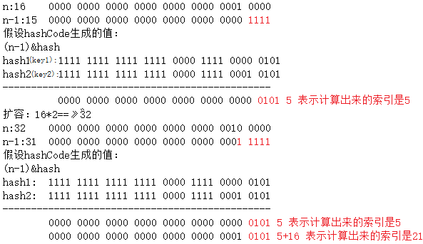

# spring黑马程序员学习笔记

安排：

day1： spring框架的概述以及spring中基于XML的IOC（反转控制）配置

day2：Spring中基于注解的IOC和IOC案例

day3：spring中的AOP和基于XML以及注解的AOP（面向切面编程）配置

day4：spring中的JDBC Temlate以及Spring事物控制

## Day1 spring框架的概述以及spring中基于XML的IOC（反转控制）配置

### 1、Spring的概述

 1.1spring的优势：**方便解耦，简化开发**

 **AOP编程的支持**

 **声明式事务的支持**

 **方便程序的测试**

 **方便集成各种优秀框架**

 Spring可以降低各种框架的使用难度，提供了对各种优秀框架（Struts、Hibernate、 Hessian、Quartz等）的直接支持。

 **降低JavaEE API的使用难度**

 **Java源码是经典学习范例**

### 2、 程序的耦合和解耦

划分模块的一个准则就是高内聚低耦合

耦合的原则：耦合是影响软件复杂程度和设计质量的一个重要因素，在设计上我们应采用以下原则：如果模块间必须存在耦合，就尽量使用数据耦合，少用控制耦合，限制公共耦合的范围，尽量避免使用内容耦合。

 1.2 spring 是什么？

 1.3 spring 的两大核心


core container是spring的核心之一，spring的任何其他部分运行都离不开它。


工厂模式创建对象的过程： 1. 用反射的方式创建对象 `bean = Class.forName(beanPath).newInstance();`

1. 有能反射的全限定类名`accountService = com.itheima.service.impl.AccountImpl`

   `accountDao = com.itheima.service.dao.impl.AccountDaoImpl`

2. 通过读取配置文件的方式来反射从而得到

3. Sverlet是一个单例对象

   在此次的例子中，`bean = Class.forName(beanPath).newInstance(); //每次都会调用默认构造函数 创建对象` 每次都会创建新的对象，而旧的被垃圾回收机制默认回收了。这就带来一个问题，多例对象运行效率没有单例对象高，因此我们使用容器解决这个问题，使它变成个单例的。

```java
package com.itheima.service.factory;

import java.io.InputStream;
import java.util.Enumeration;
import java.util.HashMap;
import java.util.Map;
import java.util.Properties;
/*
* 一个创建Bean对象工厂
*
* Bean在计算机语言中，有可重用组件的含义
* JavaBean：用java语言编写的可重用组件
*       javabean > 实体类
*
* 一个创建Bean对象工厂，它是创建我们的service和dao对象。
*   第一个：需要配置文件来配置我们的service和dao
*           配置的内容：唯一标志的名字=全限定类名（key=value）
*   第二个/
*：通过读取配置文件中的内容，反射创建对象
*
* */
public class BeanFactory {
    private static Properties prop;
    //定义一个map，用来存放我们要创建的对象
    private static Map<String,Object> beans;
    //使用静态代码块为prop赋值，编译器就开始执行
    static {
        try {
            //实例化prop
            prop = new Properties();
            //获取properties的流对象
            InputStream in = BeanFactory.class.getClassLoader().getResourceAsStream("bean.properties");
            prop.load(in);
            //实例化beans
            beans = new HashMap<String, Object>();
            Enumeration keys = prop.keys();   
             //遍历枚举
            while(keys.hasMoreElements()){
                //取出每个key值
                String key = keys.nextElement().toString();
                //根据key值得到路径
                String beanPath = prop.getProperty(key);
                //利用的到的路径，创建反射对象
                Object value = Class.forName(beanPath).newInstance();
                //把得到的key，value存到容器中
                beans.put(key,value);
            }
        }catch(Exception e){
            throw new ExceptionInInitializerError("初始化对象错误");
        }
    }

    /**
     * 根据bean的名称获取对象
     * @param beanName
     * @return
     */
    public static Object getBean(String beanName)
    {
            return beans.get(beanName);
    }

    /**
     *根据Bean的名称来获取bean对象
     * @param beanNamme
     * @return
     *
    public static Object getBean(String beanNamme){
        Object bean = null;
        try{
        String beanPath = prop.getProperty(beanNamme);
         bean = Class.forName(beanPath).newInstance();  //每次都会调用默认构造函数 创建对象
        }catch(Exception e){
            e.printStackTrace();
        }
        return bean;
    }*/
}
```

``

### 3、IOC概念和Spring中的IOC

 spring中基于XML的环境搭建

控制反转：（Inversion of Control）把创建对象的权利交给框架，是框架的重要特征。它包括依赖注入和依赖查找。

ioc的作用，降低程序间的耦合

具体解耦过程入下面步骤所示

1. 添加依赖

```properties
<?xml version="1.0" encoding="UTF-8"?>
<project xmlns="http://maven.apache.org/POM/4.0.0"
         xmlns:xsi="http://www.w3.org/2001/XMLSchema-instance"
         xsi:schemaLocation="http://maven.apache.org/POM/4.0.0 http://maven.apache.org/xsd/maven-4.0.0.xsd">
    <modelVersion>4.0.0</modelVersion>

    <groupId>com.itheima</groupId>
    <artifactId>day01_eesy_spring</artifactId>
    <version>1.0-SNAPSHOT</version>
    <packaging>jar</packaging>

    <dependencies>
        <dependency>
            <groupId>org.springframework</groupId>
            <artifactId>spring-context</artifactId>
            <version>5.1.9.RELEASE</version>
        </dependency>
    </dependencies>

</project>
1234567891011121314151617181920
```

1. 1）配置xml文件

```xml
<?xml version="1.0" encoding="UTF-8"?>
<beans xmlns="http://www.springframework.org/schema/beans"
       xmlns:xsi="http://www.w3.org/2001/XMLSchema-instance"
       xsi:schemaLocation="http://www.springframework.org/schema/beans
        https://www.springframework.org/schema/beans/spring-beans.xsd">

        <!--把对象的创建交给spring来管理-->
        <bean id="accountDao" class="com.itheima.dao.impl.AccountDaoImpl"></bean>
        <bean id="accountService" class="com.itheima.AccountService.impl.AccountImpl"></bean>
</beans>123456789
```

 2）解析spring对bean的管理细节

 1.创建bean的三种方式

 第一种：使用默认构造函数创建在spring的配置文件中使用bean标签，配以属性id和class后没有其 他属性时采用这种方式创建，如果此类中没有默认构造函数，则对象无法被创建。

 第二种：使用普通工厂中的方法创建，使用某个类中的方法创建对象，并存入spring容器（当类存 在于jar包中的，我们无法通过修改源码的方式来提供默认构造函数）

```xml
		<bean id="accountService" factory-bean="instanceFactory" factory-				method="getAccountService" >
		</bean>1
```

 第三种：使用某个类中的静态方法创建

```xml
		<bean id="accountService" class="com.itheima.factory.StaticFactory"  factory-method="getAccountService" >
		</bean>1
```

 3）Spring中的依赖注入

 注入数据： 可以注入三种数据：第一种： 基本类型和String类型

 第二种：其他bean类型（在配置文件中或者注解配置过的bean）

 第三种：复杂类型/集合类型

 注入的方式： ①默认构造函数注入 ：

 使用的标签：constructor-arg

 属性标签中的属性：

 type：用于指定构造函数中的某个或者某些参数的数据类型

 index：用于指定构造函数的位置，从0开始

 name：用于指定构造函数中的参数的名字，更为常用

 value：为基本数据类型和String类型注入具体的内容

 ref：用于指定其他的bean类型，它指定的是spring容器中出现过的bean对象

 优势：必须将构造函数中所有的参数进行内容注入

```xml
		<bean id="accountService" class="com.itheima.AccountService.impl.AccountImpl">
                <constructor-arg name="name" value="Bazahai"></constructor-arg>
                <constructor-arg name="age" value="18"></constructor-arg>
                <constructor-arg name="birthday" ref="tommoron"></constructor-arg>
        </bean>	
		<bean id="tommoron" class="java.util.Date"></bean>12345
```

 ②用set方法

 使用的标签：property
​ 不可以提供构造函数，因为构造函数注入和set方法注入是不兼容的
​ 标签中的属性：
​ name：用于注入时所调用的方法名
​ value：为基本数据类型和String类型注入具体的内容
​ ref：用于指定其他的bean类型，它指定的是spring容器中出现过的bean对象
​ 优势：可以为我们想要注入的数据注入内容，更加灵活

```xml
		<bean id="accountService2" class="com.itheima.AccountService.impl.AccountImpl2">
                <property name="userName" value="Bazahai"></property>
                <property name="age" value="17"></property>
                <property name="birthday" ref="tommoron"></property>
        </bean>
		<bean id="tommoron" class="java.util.Date"></bean>12345
```

 3）使用注解提供/复杂类型的注入

 用于给List集合注入的标签：
​ list、 array、 set
​ 用于给map集合注入的标签：
​ map、 props
​ 结构相同，标签可以互换

```xml
		<bean id="accountService3" class="com.itheima.AccountService.impl.AccountImpl3">
                <property name="myList">
                        <list>
                                <value>AAA</value>
                                <value>BBB</value>
                                <value>CCC</value>
                        </list>
                </property>

                <property name="myStr">
                        <array>
                                <value>AAA</value>
                                <value>BBB</value>
                                <value>CCC</value>
                        </array>
                </property>

                <property name="mySet">
                        <set>
                                <value>AAA</value>
                                <value>BBB</value>
                                <value>CCC</value>
                        </set>
                </property>

                <property name="myMap">
                        <map>
                                <entry key="TestA" value="AAA"></entry>
                                <entry key="TestB" value="BBB"></entry>
                                <entry key="TestC" value="CCC"></entry>
                        </map>
                </property>
        </bean>
        <bean id="tommoron" class="java.util.Date"></bean>123456789101112131415161718192021222324252627282930313233
```

 2.bean对象的生命周期

 单例对象，和容器同生共死

 多例对象，出生：当我们使用对象时

 活着：对象在使用过程中一直活着

 死亡：当对象长时间不用时，也没有别的对象引用时，被java垃圾回收机制回收

 3.bean对象的作用范围

 bean标签的scope属性，用于指定bean的作用范围。

 singleton 单例的，默认值

 prototype 多例的

 request 作用于web应用的请求范围

 session 作用于web应用的的会话范围

 global-session 作用于集群环境的会话范围，区别见下图，当不是集群时，作用等同于 session


1. 编写程序ui，运行代码

```java
package com.itheima.ui;

import com.itheima.AccountService.IAccountService;
import com.itheima.dao.AccountDao;
import org.springframework.context.ApplicationContext;
import org.springframework.context.support.ClassPathXmlApplicationContext;

/*
* 模拟一个表现层，调用业务层
* */
public class Client {
     /**
     *获取spring的Ioc核心容器，并根据id获取对象
     * ApplicationContextde三个常用实现类
     *      ClassPathXmlApplicationContext 他可以加载类路径下的配置文件，配置文件必须在类路径下，不在的话加载不了(更常用)
     *      FlieSystemXmlApplicationContext 他可以加载磁盘任意路径下的配置文件（必须有访问权限）
     *      AnnotationConfigApplicationContext 他是用于读取注解创建容器的
     *
     *核心容器的两个接口引发的问题：
     *  ApplicationContext：
     *      它在构建核心容器时，创建的方式是立即加载的方式，当配置文件被读取后就会立即创建对象
     *  BeanFactory：
     *      它构建核心容器时采用延迟加载的方式，也就是说，什么时候根据id获取对象了，什么时候才创建对象
     *
     * @param args
     */
    public static void main(String[] args) {
//        IAccountService as = new AccountImpl();
        //获取核心容器对象
        ApplicationContext ac = new ClassPathXmlApplicationContext("bean.xml");
        //根据id获取bean对象
        IAccountService as = (IAccountService)ac.getBean("accountService");
        AccountDao ado = (AccountDao) ac.getBean("accountDao");
//        AccountDao ado = ac.getBean("accountDao","accountDao.class");
        System.out.println(as);
        System.out.println(ado);
    }
}
1234567891011121314151617181920212223242526272829303132333435363738
```

### 5、Aditions：

1. java的三层架构：

   SSH：

   Struts（表示层）+Spring（业务层）+Hibernate（持久层）

 Struts是一个表示层框架，主要作用是界面展示，接收请求，分发请求

 Hibernate：Hibernate是一个持久层框架，它只负责与关系数据库的操作。

 Spring：Spring是一个业务层框架，**是一个整合的框架**，能够很好地**黏合表示层与持久层**。

1. 编译期错误

   程序开发过程的各个阶段都可能发生错误，可以将程序设计中的错误分成五类：
   ​ 1）编译期错误
   ​ 2）连接错误
   ​ 3）运行期错误
   ​ 4）逻辑性错误
   ​ 5）警告性错误
   ​ 排错是非常困难的，有可能花费很长的时间。程序设计的目标应该是避免出现太多的问题。对减少 排错能有所帮助的技术包括：好的设计、好的风格、边界条件测试、合理性检查、限制全局数据等等

   1. Ioc到底干了一件什么事？

      层层封装，形成模块化，良好代码环境，便于维护。维护不用修改源码，只操作bean就可。

      当我们不想new一个对象，在获得容器的控制权后，利用镜像的方式创建操作的类对象，调用类方法。

## 第二天：spring基于注解的IOC以及IoC的案例

1、spring中ioc的常用注解
2、案例使用xml方式和注解方式实现单表的CRUD操作
持久层技术选择：dbutils
3、改造基于注解的ioc案例，使用纯注解的方式实现
spring的一些新注解使用
4、spring和Junit整合

#### 1）关键字解析

当用于创建对象时，@Component @Service @Repository @Contoller的作用就和在XML配置文件中编写一个标签实现的功能是一样的。当使用注解注入时需要在xml文件中告知要扫描的包 “<context:component-scan base-package=“com.itheima”></context:component-scan>”

 ①@Component

- 作用：用于把当前类对象存入spring容器中
- 属性：value：用于指定bean的id。当我们不写时，它的默认值是当前类名，且首字母改小写。

 ②@Service：一般用在业务层

 ③@Repository：一般用在持久层

 ④@Contoller：一般用在表现层

以上三个注解他们的作用和属性与Component是一模一样。他们三个是spring框架为我们提供明确的三层使用的注解，使我们的三层对象更加清晰。

用于注入数据时，@Autowierd @Qualifiy @Resource的作用就和在xml配置文件中的bean标签中写一个标签的作用是一样的。

 ⑤@Autowierd

- 作用：自动按照类型注入。只要容器中有唯一的一个bean对象类型和要注入的变量类型匹配，就可以注入成功
- 如果ioc容器中没有任何bean的类型和要注入的变量类型匹配，则报错。
- 如果Ioc容器中有多个类型匹配时：出现位置：可以是变量上，也可以是方法上
- 细节：在使用注解注入时，set方法就不是必须的了。


 ⑥@Qualifiy

- 作用：在按照类中注入的基础之上再按照名称注入。它在给类成员注入时不能单独使用。但是在给方法参数注入时可以（稍后我们讲）

- 属性：value：用于指定注入bean的id。

  ⑦@Resource

  - 作用：直接按照bean的id注入。它可以独立使用
  - 属性：
  - name：用于指定bean的id。

  以上三个注入都只能注入其他bean类型的数据，而基本类型和String类型无法使用上述注解实现。另外，集合类型的注入只能通过XML来实现。

```java
/**
 * 账户的业务层实现类
 *
 * 曾经XML的配置：
 *  <bean id="accountService" class="com.itheima.service.impl.AccountServiceImpl"
 *        scope=""  init-method="" destroy-method="">
 *      <property name=""  value="" || ref=""></property>
 *  </bean> 
 *
 *      Value
 *          作用：用于注入基本类型和String类型的数据
 *          属性：
 *              value：用于指定数据的值。它可以使用spring中SpEL(也就是spring的el表达式）
 *                      SpEL的写法：${表达式}
 *
 * 用于改变作用范围的
 *      他们的作用就和在bean标签中使用scope属性实现的功能是一样的
 *      Scope
 *          作用：用于指定bean的作用范围
 *          属性：
 *              value：指定范围的取值。常用取值：singleton prototype
 *
 * 和生命周期相关的（了解）
 *      他们的作用就和在bean标签中使用init-method和destroy-methode的作用是一样的
 *      PreDestroy
 *          作用：用于指定销毁方法
 *      PostConstruct
 *          作用：用于指定初始化方法
 */
//@Service("accountService")
//@Scope("prototype")
public class AccountServiceImpl implements IAccountService {

//    @Autowired
//    @Qualifier("accountDao1")
//    @Resource(name = "accountDao2")
    @Autowired
    private IAccountDao accountDao=null;

    @PostConstruct
    public void  init(){
        System.out.println("初始化方法执行了");
    }

    @PreDestroy
    public void  destroy(){
        System.out.println("销毁方法执行了");
    }

    public void  saveAccount(){
        accountDao.saveAccount();
    }
}12345678910111213141516171819202122232425262728293031323334353637383940414243444546474849505152
```

#### 2）java的类实现

 ①账户的持久层实现类（接口略）

```java
public class AccountDaoImpl implements AccountDao {

    @Autowireds
    private QueryRunner runner;
	
/*    public void setRunner(QueryRunner runner)  当我们用注解注入的时候，set方法就不是必须的了
    {this.runner=runner;}
*/
    @Override
    public List<Account> findAllAccount() {
        try{
            return runner.query("select * from account",new BeanListHandler<Account>(Account.class));
        }catch (Exception e) {
            throw new RuntimeException(e);
        }
    }

    @Override
    public Account findAccountById(Integer accountId) {
        try{
            return runner.query("select * from account where id = ? ",new BeanHandler<Account>(Account.class),accountId);
        }catch (Exception e) {
            throw new RuntimeException(e);
        }
    }

    @Override
    public void saveAccount(Account account) {
        try{
            runner.update("insert into account(name,money)values(?,?)",account.getName(),account.getMoney());
        }catch (Exception e) {
            throw new RuntimeException(e);
        }
    }

    @Override
    public void updateAccount(Account account) {
        try{
            runner.update("update account set name=?,money=? where id=?",account.getName(),account.getMoney(),account.getId());
        }catch (Exception e) {
            throw new RuntimeException(e);
        }
    }

    @Override
    public void deleteAccount(Integer accountId) {
        try{
            runner.update("delete from account where id=?",accountId);
        }catch (Exception e) {
            throw new RuntimeException(e);
        }
    }
}12345678910111213141516171819202122232425262728293031323334353637383940414243444546474849505152
```

 ②账户的业务层实现类（接口略）

```java
public class AccountServiceImpl implements AccountService {

    @Autowired
    private AccountDao accountDao;

    @Override
    public List<Account> findAllAccount() {
        return accountDao.findAllAccount();
    }

    @Override
    public Account findAccountById(Integer accountId) {
        return accountDao.findAccountById(accountId);
    }

    @Override
    public void saveAccount(Account account) {
        accountDao.saveAccount(account);
    }

    @Override
    public void updateAccount(Account account) {
        accountDao.updateAccount(account);
    }

    @Override
    public void deleteAccount(Integer acccountId) {
        accountDao.deleteAccount(acccountId);
    }
}1234567891011121314151617181920212223242526272829
```

 ③账户的实体类

```java
public class Account implements Serializable {

    private Integer id;
    private String name;
    private Float money;

    public Integer getId() {
        return id;
    }

    public void setId(Integer id) {
        this.id = id;
    }

    public String getName() {
        return name;
    }

    public void setName(String name) {
        this.name = name;
    }

    public Float getMoney() {
        return money;
    }

    public void setMoney(Float money) {
        this.money = money;
    }

    @Override
    public String toString() {
        return "Account{" +
                "id=" + id +
                ", name='" + name + '\'' +
                ", money=" + money +
                '}';
    }
}
123456789101112131415161718192021222324252627282930313233343536373839
```

#### 3） 用xml方式实现

 ①数据配置： 数据最终注入AccountService中，因此从终结点出发，一步一步将剩下的配置齐

```xml
	<!--配置AccountService-->
	<bean id="accountService" class="AccountService的类路径">
		<!--数据的注入,accountService对象的使用必须建立在accountDao对象的建立之上-->
    	<property name="accountDao" ref="accountDao"></property>
	</bean>

	<!--配置AccountDao-->
	<bean id="accountDao" class="AccountDao的类路径">
		 <!--注入数据，AccountDao的使用必须建立在QueryRunner对象建立的基础之上-->
   		 <property name="runner" ref="runner1"></property> 
	</bean>

	<!--配置QueryRunner-->
    <bean id="runner1" class="org.apache.commons.dbutils.QueryRunner" scope="prototype">
        <!--注入数据源，需要数据源对象-->
        <constructor-arg name="ds" ref="dataSource"></constructor-arg>
    </bean>

	<!--配置dataSource-->
	<bean id="dataSource" class="com.mchange.v2.c3p0.ComboPooledDataSource">
		<properties name="driverClass" value="com.mysql.jdbc.Driver"></properties>
        <properties name="jdbcUrl" value="jdbc:mysql://localhost:3306/eesy"></properties>
        <properties name="user" value="root"></properties>
        <properties name="password" value="1234"></properties>
	</bean>

<!-- 当使用注解注入时需要告知spring在创建容器时要扫描的包 -->
<!--<context:component-scan base-package="com.itheima"></context:component-scan>
     并在需要注入的类中使用@Component  @Service 	@Repository	@Contoller 等
-->1234567891011121314151617181920212223242526272829
```

 ②测试类的编写

```java
public class AccountServiceTest{
	@Test
    public void testFindAll() {
        //1.获取容器
        ApplicationContext ac = new ClassPathXmlApplicationContext("bean.xml");
        //2.得到业务层对象
        AccountServiceImpl as = ac.getBean("accountService", AccountServiceImpl.class);
        //3.执行方法
        List<Account> accounts = as.findAllAccount();
        for(Account account : accounts){
            System.out.println(account);
        }
    }
}12345678910111213
```

#### 4）Configration，Import方式实现

```java
/**
* 添加注解Configuration后这个类就变成了配置类，它的作用和bean.xml是一样的
* spring中的新注解
* 	@Configuration
*		作用：指定当前类是一个注解类
* 	@ComponentScan
*		作用：用于通过注解指定spring在创建容器时要扫描的包
*		属性：basePackages，value的作用是一样的，用于创建容器时指定扫描的包，我们使用此注解相当于在    *			   bean.xml中配置了
*			<context:component-scan base-package="itheima"></context:component-scan>
*		细节：当配置类作为annotationConfigApplicationContext对象创建参数时，该注解可以不写
*            例如：在下面的测试类中 ac是一个annotationConfigApplicationContext对象
*			@Test
*			public void testFindAll(){
*				ApplicationContext ac = new                                           *                annotationConfigApplicationContext(SpringConfigration.class);
*				......
*			}
*		？？？	当annotationConfigApplicationContext();()中没有指定配置类路径的情况下不能省略。

* 	@Bean
*		作用：用于把当前方法的返回值作为bean对象传入到spring的ioc容器中
*		属性：
*		  name：用于指定bean的id。当不写时，默认是当前的方法名。
*		细节：
*
*	 @Import
*		作用：用于导入其它配置类
*		属性：value：用于指定其他配置类的字节码
*					当我们使用@import后，有Import注解类就是主或者父配置类。（推荐使用）
*
* 
*		  
*/
@Configuration
@ConpnentScan(basePackages = {"com.itheima"})  //basePackages，和value属性都是数组，左侧为它的标准写法。
//@ConpnentScan(com.itheima)    当注解的属性有且只有一个值，那么可以写成左边的形式
@Import(JdbcConfig.class)
public class SpringConfiguration{
    
    @Bean(name="runner")
    public QueryRunner createRunner(DataSource dataSource)
    {
        return new QueryRunner(dataSource);
    }
    //上面方法的作用效果，在加@Bean后和下面注释的内容效果相同
    /*
		<bean id="runner" class="org.apache.commons.dbutils.QueryRunner" scope="prototype">
        <!--注入数据源，需要数据源对象-->
        <constructor-arg name="ds" ref="dataSource"></constructor-arg>
    </bean>
    
    /*
    *	创建数据源对象
    *	@return
    */
    @Bean(name="dataSource")  
     public QueryRunner createRunner(){
         CombolPooledDataSource ds = CombolPooledDataSource();
         ds.setDriverClass("com.mysql.jdbc.Driver");
         ds.setJdbcUrl("jdbc:mysql://localhost:3306/eesy");
         ds.setUser("root");
         ds.setPassWord("1234");
         return ds;
     }
    //效果和下面注释代码相同
    /* 
    
    <bean id="dataSource" class="com.mchange.v2.c3p0.ComboPooledDataSource">
    <!--连接数据库的必备信息-->
    <property name="driverClass" value="com.mysql.jdbc.Driver"></property>
    <property name="jdbcUrl" value="jdbc:mysql://localhost:3306/eesy"></property>
    <property name="user" value="root"></property>
    <property name="password" value="1234"></property>
    </bean>
    
    */   
    
}
1234567891011121314151617181920212223242526272829303132333435363738394041424344454647484950515253545556575859606162636465666768697071727374757677
```

#### 5）@PropertySource方式实现

 ①配置.properties文件 (jdbcConfig.properties)

```properties
jdbc.driver=com.mysql.jdbc.Driver
jdbc.url=jdbc:mysql://localhost:3306/eesy
jdbc.username=root
jdbc.password=1234
1234
```

 ②编写配置类

```java
/** 
*	@PropertySource
*		作用：用于指定 .properties 文件的位置
*		属性：
*			value：指定文件的名称和路径。关键字： classpath
*/

@PropertySource(classpath:jdbcConfig.properties)
public class JdbcConfig{
    @value("${jdbc.driver}")
    private String driver;
    @value("${jdbc.url}")
    private String url;
    @value("${jdbc.usename}")
    private String userName;
    @value("${jdbc.password}")
    private String password;
    
    
    @Bean(name="runner")
    @Scope("prototyype")
    public QueryRunner createRunner(DataSource dataSource)
    {
        return new QueryRunner(dataSource);
    }  
    
     @Bean(name="dataSource")  
     public QueryRunner createRunner(){
         CombolPooledDataSource ds = CombolPooledDataSource();
         ds.setDriverClass("driver");
         ds.setJdbcUrl("url");
         ds.setUser("userName");
         ds.setPassWord("password");
         return ds;
     } 

}
12345678910111213141516171819202122232425262728293031323334353637
```

#### 6）junit整合

1、应用程序的入口

 main方法

2、junit单元测试中，没有main方法也能执行

 junit集成了一个main方法

 该方法就会判断该类中有哪些方法使用了@Test注解

 junit就会用有@Test注解的方法执行

3、junit不管我们是否使用了spring框架

 在执行测试方法时junit不知道我们是否使用了spring‘框架，他也不会为我们读取配置文件/配置类，创建 spring核心容器

4、由以上三点可知，测试方法执行时，没有ioc容器的存在，所以就算使用了@Autowierd注解，也无法注入

```java
/**
 * 使用Junit单元测试：测试我们的配置
 * Spring整合junit的配置
 *      1、导入spring整合junit的jar(坐标)
 *      2、使用Junit提供的一个注解把原有的main方法替换了，替换成spring提供的
 *             @Runwith
 *      3、告知spring的运行器，spring和ioc创建是基于xml还是注解的，并且说明位置
 *          @ContextConfiguration
 *                  locations：指定xml文件的位置，加上classpath关键字，表示在类路径下
 *                  classes：指定注解类所在地位置
 *
 *   当我们使用spring 5.x版本的时候，要求junit的jar必须是4.12及以上
 */
@RunWith(SpringJUnit4ClassRunner.class)
@ContextConfiguration(classes = SpringConfiguration.class)
public class AccountServiceTest {

    @Autowired
    private IAccountService as = null;


    @Test
    public void testFindAll() {
        //3.执行方法
        List<Account> accounts = as.findAllAccount();
        for(Account account : accounts){
            System.out.println(account);
        }
    }

    @Test
    public void testFindOne() {
        //3.执行方法
        Account account = as.findAccountById(1);
        System.out.println(account);
    }

    @Test
    public void testSave() {
        Account account = new Account();
        account.setName("test anno");
        account.setMoney(12345f);
        //3.执行方法
        as.saveAccount(account);

    }

    @Test
    public void testUpdate() {
        //3.执行方法
        Account account = as.findAccountById(4);
        account.setMoney(23456f);
        as.updateAccount(account);
    }

    @Test
    public void testDelete() {
        //3.执行方法
        as.deleteAccount(4);
    }
}
12345678910111213141516171819202122232425262728293031323334353637383940414243444546474849505152535455565758596061
```

#### 7）总结

 1）spring中的注解，有@Configration和@Import两种，前者支持的是并列关系的两个或两个以上 的注解类，使用后者则代表这是一个父配置类。

 2）几种配置方式优缺点对比

 xml：配置有一定的复杂

 注解：并不一定省事

 很多情况下用xml和注解混用的方式

从整个案例的过程可以看出一些端倪，业务逻辑层和持久层之间的联系。业务层调用持久层，对数据库进行操作。用maven工程创建整个案例的过程中，我们发现当创建了工程后，导入一堆坐标，即引如一堆可以使用的jar包，我们只可以使用但不可以修改这些包的内瓤。spring这个容器给了我们很多方便。容许我们导入，并且创建包内各类的对象，方便我们的使用。

## 第三天

#### 1、回顾之前讲过的一个技术：动态代理（proxy）

 动态代理：

- 特点：字节码随用随创建，随用随加载。它与静态代理的区别也在于此。因为静态代理是字节码一上来就 创建好，并完成加载。 装饰者模式就是静态代理的一种体现。
- 作用：在不修改源码的基础上对方法增强
- 分类：①**基于jdk的动态代理** （基于接口的动态代理）

 ②**基于子类的动态类**

- 基于接口的动态代理

  如何创建代理对象：使用Proxy类中的newProxyInstance方法

  1）涉及的类：jdk官方提供的 Proxy；

 2）要求：被代理类必须至少实现一个接口，如果没有则不能使用

 3）newProxyInstance方法的参数：

 classLoader类加载器：它是用于加载代理对象字节码的，和被加载对象使用相同的类加载器

 Class[] 字节码数组

 InvocationHandler 用于提供增强的代码，通常情况下时匿名内部类，但不必须

- 基于子类的动态代理：

  如何创建代理对象：使用Enhancer类中的create方法

  1）涉及的类：Enhancer；提供者：cglib库

  2）要求：被代理类不能是最终类

  3）create()方法的参数：

 class：字节码

 类加载器：它是用于加载代理对象字节码的，和被加载对象使用相同的类加载器

 Callback： 用于提供增强的代码，通常情况下时匿名内部类，但不必须。我们一般写的是该接口的子 接口实现类

- 导入依赖

```xml
<dependencies>
	<dependency>
		<groupId>cglib<groupId>
		<artifactId>cglib<artifactId>
		<version>版本号<version>
	<dependency>
<dependencies>
1234567
/*
*	基于接口的动态代理
*/
IProducer proxyProducer = (IProducer) Proxy.newProxyInstance(producer.getClass().getClassLoader(),
                producer.getClass().getInterfaces(),
                new InvocationHandler() {
                    /**
                     * 作用：执行被代理对象的任何接口方法都会经过该方法
                     * 方法参数的含义
                     * @param proxy   代理对象的引用
                     * @param method  当前执行的方法
                     * @param args    当前执行方法所需的参数
                     * @return        和被代理对象方法有相同的返回值
                     * @throws Throwable
                     */
                    @Override
                    public Object invoke(Object proxy, Method method, Object[] args) throws Throwable {
                        //提供增强的代码
                        Object returnValue = null;	
                        //1.获取方法执行的参数
                        Float money = (Float)args[0];
                        //2.判断当前方法是不是销售
                        if("saleProduct".equals(method.getName())) {
                            returnValue = method.invoke(producer, money*0.8f);
                        }
                        return returnValue;
                    }
                });
        proxyProducer.saleProduct(10000f);

/*
*	基于子类的动态代理
*/
Producer cglibProducer = (Producer)Enhancer.create(producer.getClass(), new MethodInterceptor() {
            /**
             * 执行北地阿里对象的任何方法都会经过该方法
             * @param proxy
             * @param method
             * @param args
             *    以上三个参数和基于接口的动态代理中invoke方法的参数是一样的
             * @param methodProxy ：当前执行方法的代理对象
             * @return
             * @throws Throwable
             */
            @Override
            public Object intercept(Object proxy, Method method, Object[] args, MethodProxy methodProxy) throws Throwable {
                //提供增强的代码
                Object returnValue = null;

                //1.获取方法执行的参数
                Float money = (Float)args[0];
                //2.判断当前方法是不是销售
                if("saleProduct".equals(method.getName())) {
                    returnValue = method.invoke(producer, money*0.8f);
                }
                return returnValue;
            }
        });
        cglibProducer.saleProduct(12000f);
1234567891011121314151617181920212223242526272829303132333435363738394041424344454647484950515253545556575859
```

#### 2、AOP的概念

 作用： 在程序运行期间，不修改源码对已有方法进行增强。

 优势： 减少重复代码 提高开发效率 维护方便

 AOP的实现方式：使用动态代理技术

```xml
<!--配置AOP-->
    <aop:config>
        <!-- 配置切入点表达式 id属性用于指定表达式的唯一标识。expression属性用于指定表达式内容
              此标签写在aop:aspect标签内部只能当前切面使用。
              它还可以写在aop:aspect外面，此时就变成了所有切面可用
          -->
        <aop:pointcut id="pt1" expression="execution(* com.itheima.service.impl.*.*(..))"></aop:pointcut>
        <!--配置切面 -->
        <aop:aspect id="logAdvice" ref="logger">
            <!-- 配置前置通知：在切入点方法执行之前执行-->
            <aop:before method="beforePrintLog" pointcut-ref="pt1" ></aop:before>

            <!-- 配置后置通知：在切入点方法正常执行之后值。它和异常通知永远只能执行一个-->
            <aop:after-returning method="afterReturningPrintLog" pointcut-ref="pt1"></aop:after-returning>

            <!-- 配置异常通知：在切入点方法执行产生异常之后执行。它和后置通知永远只能执行一个-->
            <aop:after-throwing method="afterThrowingPrintLog" pointcut-ref="pt1"></aop:after-throwing>

            <!-- 配置最终通知：无论切入点方法是否正常执行它都会在其后面执行-->
            <aop:after method="afterPrintLog" pointcut-ref="pt1"></aop:after>

            <!-- 配置环绕通知 详细的注释请看Logger类中-->
            <aop:around method="aroundPringLog" pointcut-ref="pt1"></aop:around>
        </aop:aspect>
    </aop:config>
12345678910111213141516171819202122232425
```

#### 3、spring中的AOP相关术语

```
* JoinPoint 连接点：所有的切入点都是连接点，反过来不成立
* pointcut 切入点：被增强的方法称为切入点
* Advice 通知：

1234
```


- Target 目标对象
- Weaving 织入：是指把增强应用到目标对象来创建新的代理对象的过程。 spring 采用动态代理织入，而 AspectJ 采用编译期织入和类装载期织入
- Proxy 代理：一个类被 AOP 织入增强后，就产生一个结果代理类
- Aspect 切面：是切入点和通知（提供了公共代码的类）（引介）的结合。

#### 4、spring中基于XML和注解的AOP配置

思路分析：要将数据库的四个连接进行管理，要么全部发生，要么全不发生

  1. 创建好转账方法后

 2 创建一个连接的工具类，用于从数据源上获取连接，实现和和线程的

 3 创建和事务管理相关的类，包含了开启、提交、回滚事务和释放连接

 4 为了防止因为修改某些类中的方法而造成后期维护问题，因此使用动态代理。

 *在业务中使用动态代理，一般是为了给需要实现的方法添加预处理或者添加后续操作，但是不干 预实现类的正常业务，把一些基本业务和主要的业务逻辑分离。我们一般所熟知的Spring的AOP 原理就是基于动态代理实现的。


#### 5.、总结：

- 第一步是对我们业务进行事务管理（原例中为try，catch，finally方式实现），让所有的sql语句执行时同时发生，如果出现异常则都不执行。但第一种方法产生了新的问题：代码变得十分臃肿。
- 第二步使用动态代理，解决代码臃肿问题（基于结构的动态代理和基于子类的动态代理）此种方法的增强应用于本地对象的所有方法
- 使用AOP配置的方式实现前置，后置，异常，最终和环绕通知。

#### 6、Additions：

 连接池：把消耗时间获取连接的一部分放到应用加载一开始。在web应用中当我们启动tomCat加载应用时，我们创建一些连接从而在后续项目运行时不再和数据库进行连接，保证了我们使用connection时的效率。此时服务器也有一个池（线程池：它的特点是当TomCat启动时会初始化一大堆的线程，放到一个容器中，此后每当我们需要时他就会从线程池中取出一个线程供我们使用）


## 第四天

### 1、Jdbc简介

jdbc都是单表使用，不加多表是因为，多表操作是sql语句的职责。

jdbcTemplate：用来操作关系型数据库的。支持增删改。

位于：spring-jdbc-5.0.2.RELEASE.jar

还需要导入：spring-tx-5.0.2.RELEASE.jar，用于事务管理的

使用jdbc模板时需要配置模板

```xml
<!--配置JdbcTemplate-->
    <bean id="jdbcTemplate" class="org.springframework.jdbc.core.JdbcTemplate">
        <property name="dataSource" ref="dataSource"></property>
    </bean>

    <!-- 配置数据源-->
    <bean id="dataSource" class="org.springframework.jdbc.datasource.DriverManagerDataSource">
        <property name="driverClassName" value="com.mysql.jdbc.Driver"></property>
        <property name="url" value="jdbc:mysql://localhost:3306/eesy"></property>
        <property name="username" value="root"></property>
        <property name="password" value="1234"></property>
    </bean>1234567891011
```

jdbcTemplate使用操作

```java
//JdbcTemplate的CRUD操作
public class JdbcTemplateDemo2{
    public static void main(String[] args) {
        //1.获取容器
        ApplicationContext ac = new ClassPathXmlApplicationContext("bean.xml");
        //2.获取对象
        JdbcTemplate jt = ac.getBean("jdbcTemplate",JdbcTemplate.class);
        //3.执行操作
        jt.execute("insert into account(name,money)values('ddd',2222)");
        
        //保存操作
        jt.update("insert into account(name,money)values(?,?)","fff",5000);
        
        //更新操作
        jt.update("update account set money = money-? where id = ?",300,6);
        
        //删除操作
        jt.update("delete from account where id = ?",6);
        
        //查询所有
 //        List<Account> accounts = jt.query("select * from account where money > ?",new AccountRowMapper(),1000f);
        //AccountRowMapper，BeanPropertyRowMapper从集合的角度讲他们俩的作用是一样的，都是将Account对象封装到集合中。
        List<Account> accounts = jt.query("select * from account where money > ?",new BeanPropertyRowMapper<Account>(Account.class),1000f);
	        for(Account account : accounts){
            System.out.println(account);
        }
}
    
   /**
 * 定义Account的封装策略
 */
class AccountRowMapper implements RowMapper<Account>{
    /**
     * 把结果集中的数据封装到Account中，然后由spring把每个Account加到集合中
     * @param rs
     * @param rowNum
     * @return
     * @throws SQLException
     */
    @Override
    public Account mapRow(ResultSet rs, int rowNum) throws SQLException {
        Account account = new Account();
        account.setId(rs.getInt("id"));
        account.setName(rs.getString("name"));
        account.setMoney(rs.getFloat("money"));
        return account;
    }
}
        
      //查询一个
      //使用RowMapper的方式：常用的方式
      //  List<Account> as = jt.query("select * from account where id = ? ", new AccountRowMapper(), 55);
      // 使用ResultSetExtractor的方式:不常用的方式
      //  Account account = jt.query("select * from account where id = ?", new AccountResultSetExtractor(),3);
        List<Account> accounts = jt.query("select * from account where id = ?",new BeanPropertyRowMapper<Account>(Account.class),1);
        System.out.println(accounts.isEmpty()?"没有内容":accounts.get(0));
        
        //查询返回一行一列（使用聚合函数，但不加group by子句）
        Long count = jt.queryForObject("select count(*) from account where money > ?",Long.class,1000f);
        System.out.println(count);1234567891011121314151617181920212223242526272829303132333435363738394041424344454647484950515253545556575859
```


当dao有很多个时，每个dao都有重复代码，能不能把他抽取出来呢？spring框架正好给我们提供了一个dbcDaoSupport，使用时我们可以让dao继承它。使用它的set方法，方便在xml中注入。

让Dao继承JdbcDaoSupport的方式，只能用于基于XML的方式，注解用不了。

```java
public final void setDataSource(DataSource dataSource) {
        if (this.jdbcTemplate == null || dataSource != this.jdbcTemplate.getDataSource()) {
            this.jdbcTemplate = this.createJdbcTemplate(dataSource);
            this.initTemplateConfig();
        }

    }123456
```

### 2、事务控制

#### 1）事务控制简介

第一：JavaEE体系进行**分层开发**，事务处理位于业务层，Spring提供了分层设计业务层的事务处理解决方案。

第二：spring框架为我们提供了一组事务控制的接口。这组接口是在spring-***tx***-5.0.2.RELEASE.jar中。

1）**PlatformTransactionManager** 此接口是spring的事务管理器，它里面提供了我们常用的操作事务的方法

实现类：org.springframework.jdbc.datasource.**DataSourceTransactionManager** 使用Spring JDBC或iBatis 进行持久化数据时使用

–获取事务状态信息：TransactionStatue getTransaction(TransactionDefinition define)

–提交事务：void commit(TransactionStatus status)

–回滚事务：void rollback(TransactionStatus status)

2）**TransactionDefinition** 它是事务的定义信息对象


获取事务对象名称：String getName()

获取事务隔离级：int getIsolationLevel()

 未提交读取（Read Uncommitted） Spring标识：ISOLATION_READ_UNCOMMITTED

 已提交读取（Read Committed）Spring标识：ISOLATION_READ_COMMITTED。

 可重复读取（Repeatable Read）Spring标识：ISOLATION_REPEATABLE_READ。

 序列化（Serializable）Spring标识：ISOLATION_SERIALIZABLE。

|            | 读数据一致性                             | 脏读 | 不可读 | 幻读 |
| ---------- | ---------------------------------------- | ---- | ------ | ---- |
| 未提交读取 | 最低阶别，只能保证不读取物理上损坏的数据 | √    | √      | √    |
| 已提交读取 | 语句级 **Oracle默认级**                  | ×    | √      | √    |
| 可重复读取 | 事务级 **Mysql默认级别**                 | ×    | ×      | √    |
| 序列化     | 最高级别，事务级                         | ×    | ×      | ×    |

获取事务传播行为：int getPropagationBehavior()

 ①REQUIRED：如果当前没有事务，就新建一个事务，如果已经存在一个事务中，加入到这个事务中。一般的选 择（默认值）

 ②SUPPORTS：支持当前事务，如果当前没有事务，就以非事务方式执行（没有事务）

 ③MANDATORY：使用当前的事务，如果当前没有事务，就抛出异常

 ④REQUERS_NEW：新建事务，如果当前在事务中，把当前事务挂起。

 ⑤NOT_SUPPORTED：以非事务方式执行操作，如果当前存在事务，就把当前事务挂起

 ⑥NEVER：以非事务方式运行，如果当前存在事务，抛出异常

 ⑦NESTED：如果当前存在事务，则在嵌套事务内执行。如果当前没有事务，则执行REQUIRED类似的操作。

 获取事务超时时间：int getTimeOut() 默认值是-1，没有超时限制。如果有，以秒为单位进行设置。

 //读写型事务，怎删改，也会开启事务

获取事务是否只读：boolean isReadOnly() //只读型事务，执行查询时也会开启事务

3）**TransactionStatus** 此接口提供的是事务具体的运行状态

 刷新事务：void flush()

 获取是否存在存储点：boolean hasSavepoint()

 获取事务是否完成：boolean isComplecated()

 获取事务是否为新事物：boolean isNewTransaction()

 获取事务是否回滚：boolean isRollBackOnly()

 设置事务回滚：void setRollBackOnly()

第三：spring的事务控制都是基于AOP的，它既可以使用编程的方式实现，也可以使用配置的方式实现。我们学习的重点是使用配置的方式实现。

```java
@Component("txManager")
@Aspect
public class TransactionManager {

    @Autowired
    private ConnectionUtils connectionUtils;

    @Pointcut("execution(* com.itheima.service.impl.*.*(..))")
    private void pt1(){}


    /**
     * 开启事务
     */
    public  void beginTransaction(){
        try {
            connectionUtils.getThreadConnection().setAutoCommit(false);
        }catch (Exception e){
            e.printStackTrace();
        }
    }

    /**
     * 提交事务
     */
    public  void commit(){
        try {
            connectionUtils.getThreadConnection().commit();
        }catch (Exception e){
            e.printStackTrace();
        }
    }

    /**
     * 回滚事务
     */
    public  void rollback(){
        try {
            connectionUtils.getThreadConnection().rollback();
        }catch (Exception e){
            e.printStackTrace();
        }
    }


    /**
     * 释放连接
     */
    public  void release(){
        try {
            connectionUtils.getThreadConnection().close();//还回连接池中
            connectionUtils.removeConnection();
        }catch (Exception e){
            e.printStackTrace();
        }
    }

    @Around("pt1()")
    public Object aroundAdvice(ProceedingJoinPoint pjp){
        Object rtValue = null;
        try {
            //1.获取参数
            Object[] args = pjp.getArgs();
            //2.开启事务
            this.beginTransaction();
            //3.执行方法
            rtValue = pjp.proceed(args);
            //4.提交事务
            this.commit();

            //返回结果
            return  rtValue;

        }catch (Throwable e){
            //5.回滚事务
            this.rollback();
            throw new RuntimeException(e);
        }finally {
            //6.释放资源
            this.release();
        }
    }
}


@Component("connectionUtils")
public class ConnectionUtils {

    private ThreadLocal<Connection> tl = new ThreadLocal<Connection>();

    @Autowired
    private DataSource dataSource;


    /**
     * 获取当前线程上的连接
     * @return
     */
    public Connection getThreadConnection() {
        try{
            //1.先从ThreadLocal上获取
            Connection conn = tl.get();
            //2.判断当前线程上是否有连接
            if (conn == null) {
                //3.从数据源中获取一个连接，并且存入ThreadLocal中
                conn = dataSource.getConnection();
                conn.setAutoCommit(false);
                tl.set(conn);
            }
            //4.返回当前线程上的连接
            return conn;
        }catch (Exception e){
            throw new RuntimeException(e);
        }
    }

    /**
     * 把连接和线程解绑
     */
    public void removeConnection(){
        tl.remove();
    }
}
123456789101112131415161718192021222324252627282930313233343536373839404142434445464748495051525354555657585960616263646566676869707172737475767778798081828384858687888990919293949596979899100101102103104105106107108109110111112113114115116117118119120121122123
```

#### 2）基于XML的声明式事务控制

```xml
导入xsi、aop和tx命名空间
<?xml version="1.0" encoding="UTF-8"?> 
<beans xmlns="http://www.springframework.org/schema/beans" xmlns:xsi="http://www.w3.org/2001/XMLSchema-instance" xmlns:aop="http://www.springframework.org/schema/aop" xmlns:tx="http://www.springframework.org/schema/tx" xsi:schemaLocation="http://www.springframework.org/schema/beans http://www.springframework.org/schema/beans/spring-beans.xsd http://www.springframework.org/schema/tx http://www.springframework.org/schema/tx/spring-tx.xsd http://www.springframework.org/schema/aop http://www.springframework.org/schema/aop/spring-aop.xsd">
</beans>

在配置文件中配置业务层和持久层对
<!-- 配置service --> 
<bean id="accountService" class="com.itheima.service.impl.AccountServiceImpl">
    <property name="accountDao" ref="accountDao"></property>
</bean>
<!-- 配置dao --> 
<bean id="accountDao" class="com.itheima.dao.impl.AccountDaoImpl">
<!-- 注入dataSource -->
    <property name="dataSource" ref="dataSource"></property> 
</bean> 

<!-- 配置数据源 --> 
<bean id="dataSource" class="org.springframework.jdbc.datasource.DriverManagerDataSource"> 
        <property name="driverClassName" value="com.mysql.jdbc.Driver">
        </property> <property name="url" value="jdbc:mysql:///spring_day04">
        </property> <property name="username" value="root">
        </property> <property name="password" value="1234"></property> 
</bean>

<!-- 配置一个事务管理器 -->
<bean id="transactionManager" class="org.springframework.jdbc.datasource.DataSourceTransactionManager">
<!-- 注入DataSource --> 
    <property name="dataSource" ref="dataSource"></property> 
</bean>

配置事务的通知引用事务管理器
<!-- 事务的配置 -->
<tx:advice id="txAdvice" transaction-manager="transactionManager"> 
</tx:advice>
配置事务的属性：
<!--在tx:advice标签内部 配置事务的属性 -->
<tx:attributes>
<!-- 指定方法名称：是业务核心方法 
	read-only：是否是只读事务。默认false，不只读。
 	isolation：指定事务的隔离级别。默认值是使用数据库的默认隔离级别。 
	propagation：指定事务的传播行为。 
	timeout：指定超时时间。默认值为：-1。永不超时。 
	rollback-for：用于指定一个异常，当执行产生该异常时，事务回滚。产生其他异常，事务不回滚。没有默认值，		任何异常都回滚。 
	no-rollback-for：用于指定一个异常，当产生该异常时，事务不回滚，产生其他异常时，事务回滚。没有默认值，任何异常都回滚。 -->
<tx:method name="*" read-only="false" propagation="REQUIRED"/> 
<tx:method name="find*" read-only="true" propagation="SUPPORTS"/> 
</tx:attributes>

配置切入点表达式
<!-- 配置aop -->
<aop:config>
    <!-- 配置切入点表达式 --> 
    <aop:pointcut expression="execution(* com.itheima.service.impl.*.*(..))" id="pt1"/> </aop:config>
<!-- 在aop:config标签内部：建立事务的通知和切入点表达式的关系 --> 
<aop:advisor advice-ref="txAdvice" pointcut-ref="pt1"/>123456789101112131415161718192021222324252627282930313233343536373839404142434445464748495051525354
```

#### 3）基于注解的配置方式

创建aop、xsi、context和tx命名空间

```xml
<!-- 配置spring创建容器时要扫描的包 --> 
<context:component-scan base-package="com.itheima"></context:component-scan> 

<!-- 配置JdbcTemplate-->
<bean id="jdbcTemplate" class="org.springframework.jdbc.core.JdbcTemplate"> 
    <property name="dataSource" ref="dataSource"></property>
</bean> 

<!-- 配置spring提供的内置数据源 --> 
<bean id="dataSource" class="org.springframework.jdbc.datasource.DriverManagerDataSource"> 
    <property name="driverClassName" value="com.mysql.jdbc.Driver"></property>
    <property name="url" value="jdbc:mysql://localhost:3306/spring_day02"></property> 
    <property name="username" value="root"></property> 
    <property name="password" value="1234"></property> 
</bean> 

<!-- 配置事务管理器 -->
<bean id="transactionManager" class="org.springframework.jdbc.datasource.DataSourceTransactionManager"> 
    <property name="dataSource" ref="dataSource"></property>
</bean>

<!-- 开启spring对注解事务的支持 --> 
<tx:annotation-driven transaction-manager="transactionManager"/>12345678910111213141516171819202122
```

在业务层使用@Transactional注解

```java
@Service("accountService") 
@Transactional(readOnly=true,propagation=Propagation.SUPPORTS)
public class AccountServiceImpl implements IAccountService {
    
 @Autowired 
    private IAccountDao accountDao; 
 @Override 
    public Account findAccountById(Integer id) 
    { return accountDao.findAccountById(id); } 
    
 @Override 
 @Transactional(readOnly=false,propagation=Propagation.REQUIRED)
    public void transfer(String sourceName, String targeName, Float money){
        
    }
}
该注解的属性和xml中的属性含义一致。该注解可以出现在接口上，类上和方法上。
出现接口上，表示该接口的所有实现类都有事务支持。 
出现在类上，表示类中所有方法有事务支持 
出现在方法上，表示方法有事务支持。 
以上三个位置的优先级：方法>类>接口1234567891011121314151617181920
```

### 3、spring5新特性

核心容器的更新：Spring Framework 5.0 现在支持候选组件索引作为类路径扫描的替代方案。索引读取 &扫描类路径JetBrains Kotlin语言支持：响应式编程风格：Junit5支持：依赖类库的更新：终止支持一些类库

### Spring中都用到了那些设计模式?

- **工厂设计模式:** Spring使用工厂模式通过 BeanFactory、ApplicationContext 创建 bean 对象。
- **代理设计模式** : Spring AOP 功能的实现。
- **单例设计模式** : Spring 中的 Bean 默认都是单例的。
- **模板方法模式** : Spring 中 jdbcTemplate、hibernateTemplate 等以 Template 结尾的对数据库操作的类，它们就使用到了模板模式。
- **包装器设计模式** : 我们的项目需要连接多个数据库，而且不同的客户在每次访问中根据需要会去访问不同的数据库。这种模式让我们可以根据客户的需求能够动态切换不同的数据源。
- **观察者模式:** Spring 事件驱动模型就是观察者模式很经典的一个应用。
- **适配器模式** :Spring AOP 的增强或通知(Advice)使用到了适配器模式、spring MVC 中也是用到了适配器模式适配Controller。

#  Java容器

## 一、HashMap 集合简介

- HashMap 基于哈希表的 Map 接口实现，是以 key-value 存储形式存在，即主要用来存放键值对。HashMap 的实现不是同步的，这意味着它不是线程安全的。它的 key、value 都可以为 null，此外，HashMap 中的映射不是有序的。

- jdk1.8 之前 HashMap 由 **数组 + 链表** 组成，数组是 HashMap 的主体，链表则是主要为了解决哈希冲突（**两个对象调用的 hashCode 方法计算的哈希值一致导致计算的教组索引值相同**）而存在的（“拉链法”解决冲突）。jdk1.8 以后在解决哈希冲突时有了较大的变化，**当链表长度大于阈值（或者红黑树的边界值，默认为 8 ）并且当前数组的长度大于64时，此时此索引位置上的所有数据改为使用红黑树存储。**

- 补充：将链表转换成红黑树前会判断，即便阈值大于8，但是数组长度小于64，此时并不会将链表变为红黑树，而是选择逬行数组扩容。

  这样做的目的是因为数组比较小，尽量避开红黑树结构，这种情况下变为红黑树结构，反而会降低效率，因为红黑树需要逬行左旋，右旋，变色这些操作来保持平衡。同时数组长度小于64时，搜索时间相对要快些。所以结上所述为了提高性能和减少搜索时间，底层阈值大于8并且数组长度大于64时，链表才转换为红黑树，具体可以参考 treeifyBin() 方法。

  当然虽然增了红黑树作为底层数据结构，结构变得复杂了，但是阈值大于8并且数组长度大于64时，链表转换为红黑树时，效率也变的更高效。

- 小结：

  HashMap 特点：

  1. 存储无序的。
  2. 键和值位置都可以是 null，但是键位置只能存在一个 null。
  3. 键位置是唯一的，是底层的数据结构控制的。
  4. jdk1.8 前数据结构是**链表+数组**，jdk1.8 之后是**链表+数组+红黑树**。
  5. 阈值（边界值）> 8 并且数组长度大于 64，才将链表转换为红黑树，变为红黑树的目的是为了高效的查询。

## 二、HashMap 集合底层的数据结构

#### 2.1 存储数据的过程

示例代码：

```java
HashMap<String, Integer> map = new HashMap<>();
map.put("柳岩", 18);
map.put("杨幂", 28);
map.put("刘德华", 40);
map.put("柳岩", 20);
12345
```

输出结果：

```java
{杨幂=28, 柳岩=20, 刘德华=40}
1
```

分析：

1. 当创建 HashMap 集合对象的时候，在 jdk1.8 之前，构造方法中创建一个长度是16的 Entry[] table 用来存储键值对数据的。在 jdk1.8 以后不是在 HashMap 的构造方法底层创建数组了，是在第一次调用 put 方法时创建的数组 Node[] table 用来存储键值对数据。

2. 假设向哈希表中存储 <柳岩,18> 数据，根据柳岩调用 String 类中重写之后的 hashCode() 方法计算出值，然后结合数组长度采用某种算法计算出向 Node 数组中存储数据的空间的索引值。如果计算出的索引空间没有数据，则直接将<柳岩,18>存储到数组中。（举例：计算出的索引是 3 ）

3. 向哈希表中存储数据 <刘德华,40>，假设算出的 hashCode() 方法结合数祖长度计算出的索引值也是3，那么此时数组空间不是 null，此时底层会比较柳岩和刘德华的 hash 值是否一致，如果不一致，则在空间上划出一个结点来存储键值对数据对 <刘德华,40>，这种方式称为拉链法。

4. 假设向哈希表中存储数据 <柳岩,20>，那么首先根据柳岩调用 hashCode() 方法结合数组长度计算出索引肯定是 3，此时比较后存储的数据柳岩和已经存在的数据的 hash 值是否相等，如果 hash 值相等，此时发生哈希碰撞。那么底层会调用柳岩所属类 String 中的 equals() 方法比较两个内容是否相等：

   相等：将后添加的数据的 value 覆盖之前的 value。

   不相等：继续向下和其他的数据的 key 进行比较，如果都不相等，则划出一个结点存储数据，如果结点长度即链表长度大于阈值 8 并且数组长度大于 64 则将链表变为红黑树。
   

5. 在不断的添加数据的过程中，会涉及到扩容问题，当超出阈值（且要存放的位置非空）时，扩容。默认的扩容方式：扩容为原来容量的 2 倍，并将原有的数据复制过来。

6. 综上描述，当位于一个表中的元素较多，即 hash 值相等但是内容不相等的元素较多时，通过 key 值依次查找的效率较低。而 jdk1.8 中，哈希表存储采用数组+链表+红黑树实现，当链表长度（阈值）超过8且当前数组的长度大于64时，将链表转换为红黑树，这样大大减少了查找时间。

   简单的来说，哈希表是由数组+链表+红黑树（JDK1.8增加了红黑树部分）实现的。如下图所示：
   

7. jdk1.8 中引入红黑树的进一步原因：

   jdk1.8以前 HashMap 的实现是数组+链表，即使哈希函数取得再好，也很难达到元素百分百均匀分布。当HashMap中有大量的元素都存放到同一个桶中时，这个桶下有一条长长的链表，这个时候 HashMap 就相当于一个单链表，假如单链表有n个元素，遍历的时间复杂度就是O(n)，完全失去了它的优势。

   针对这种情况，jdk1.8中引入了红黑树（查找时间复杂度为O(logn)）来优化这个问题。当链表长度很小的时候，即使遍历，速度也非常快，但是当链表长度不断变长，肯定会对查询性能有一定的影响，所以才需要转成树。

8. 总结：


说明：

- size 表示 HashMap 中键值对的实时数量，注意这个不等于数组的长度。
- threshold（临界值）= capacity（容量）* loadFactor（负载因子）。这个值是当前已占用数组长度的最大值。size超过这个值就重新 resize（扩容），扩容后的 HashMap 容量是之前容量的两倍。

#### 2.3 面试题

1. **HashMap 中 hash 函数是怎么实现的？还有哪些hash函数的实现方式？**
   答：对于 key 的 hashCode 做 hash 操作，无符号右移 16 位然后做异或运算。还有平方取中法，伪随机数法和取余数法。这三种效率都比较低。而无符号右移 16 位异或运算效率是最高的。
2. **当两个对象的 hashCode 相等时会怎么样？**
   答：会产生哈希碰撞。若 key 值内容相同则替换旧的 value，不然连接到链表后面，链表长度超过阈值 8 就转换为红黑树存储。
3. **什么是哈希碰撞，如何解决哈希碰撞？**
   答：只要两个元素的 key 计算的哈希码值相同就会发生哈希碰撞。jdk8 之前使用链表解决哈希碰撞。jdk8之后使用链表 + 红黑树解决哈希碰撞。
4. **如果两个键的 hashCode 相同，如何存储键值对？**
   答：通过 equals 比较内容是否相同。相同：则新的 value 覆盖之前的 value。不相同：则将新的键值对添加到哈希表中。

## 三、HashMap继承关系

HashMap继承关系如下图所示：


**说明**：

- Cloneable 空接口，表示可以克隆。创建并返回 HashMap 对象的一个副本。
- Serializable 序列化接口。属于标记性接口。HashMap 对象可以被序列化和反序列化。
- AbstractMap 父类提供了 Map 实现接口。以最大限度地减少实现此接口所需的工作。

**补充**：

通过上述继承关系我们发现一个很奇怪的现象，就是 HashMap 已经继承了AbstractMap 而 AbstractMap 类实现了Map 接口，那为什么 HashMap 还要在实现 Map 接口呢？同样在 ArrayList 中 LinkedLis 中都是这种结构。

据 Java 集合框架的创始人 Josh Bloch 描述，这样的写法是一个失误。在 Java 集合框架中，类似这样的写法很多，最幵始写 Java 集合框架的时候，他认为这样写，在某些地方可能是有价值的，直到他意识到错了。显然的，jdk 的维护者，后来不认为这个小小的失误值得去修改，所以就这样保留下来了。

## 四、HashMap 集合类的成员

#### 4.1 成员变量

###### 4.1.1 serialVersionUID

序列化版本号

```java
private static final long serialVersionUID = 362498820763181265L;
1
```

###### 4.1.2 DEFAULT_INITIAL_CAPACITY

集合的初始化容量（必须是 2 的 n 次幂）

```java
// 默认的初始容量是16	1 << 4 相当于 1*2的4次方
static final int DEFAULT_INITIAL_CAPACITY = 1 << 4;
12
```

**问题：为什么必须是 2 的 n 次幂？如果输入值不是 2 的幂比如 10 会怎么样?**

HashMap 构造方法还可以指定集合的初始化容量大小：

```java
// 构造一个带指定初始容量和默认负载因子（0.75)的空 HashMap。
HashMap(int initialCapacity)
12
```

根据上述讲解我们已经知道，当向 HashMap 中添加一个元素的时候，需要根据 key 的 hash 值，去确定其在数组中的具体位置。HashMap 为了存取高效，减少碰撞，就是要尽量把数据分配均匀，每个链表长度大致相同，这个实现的关键就在把数据存到哪个链表中的算法。

这个算法实际就是取模，hash % length，计算机中直接求余效率不如位移运算。所以源码中做了优化，使用 hash & (length - 1)，而实际上 hash % length 等于 hash & ( length - 1) 的前提是 length 是 2 的 n 次幂。

例如长度为 8 的时候，3 & (8 - 1) = 3，2 & (8 - 1) = 2，不同位置上，不碰撞。

```java
/**
* Returns a power of two size for the given target capacity.
*/
static final int tableSizeFor(int cap) {
  int n = cap - 1;
  n |= n >>> 1;
  n |= n >>> 2;
  n |= n >>> 4;
  n |= n >>> 8;
  n |= n >>> 16;
  return (n < 0) ? 1 : (n >= MAXIMUM_CAPACITY) ? MAXIMUM_CAPACITY : n + 1;
}
123456789101112
```

**说明**：

当在实例化 HashMap 实例时，如果给定了 initialCapacity，由于 HashMap 的 capacity 必须都是 2 的幂，因此这个方法用于找到大于等于 initialCapacity 的最小的 2 的幂。

**分析**：

1. int n = cap - 1;
   防止 cap 已经是 2 的幂。如果 cap 已经是 2 的幂，又没有这个减 1 操作，则执行完后面的几条无符号操作之后，返回的 capacity 将是这个 cap 的 2 倍。
2. 如果 n 这时为 0 了（经过了cap - 1后），则经过后面的几次无符号右移依然是 0，最后返回的 capacity 是1（最后有个 n + 1 的操作）。
3. 注意：容量最大也就是 32bit 的正数，因此最后 n |= n >>> 16; 最多也就 32 个 1（但是这已经是负数了，在执行 tableSizeFor 之前，对 initialCapacity 做了判断，如果大于MAXIMUM_CAPACITY(2 ^ 30)，则取 MAXIMUM_CAPACITY。如果等于MAXIMUM_CAPACITY，会执行位移操作。所以这里面的位移操作之后，最大 30 个 1，不会大于等于 MAXIMUM_CAPACITY。30 个 1，加 1 后得 2 ^ 30）。

**完整例子**：


注意：得到的这个 capacity 却被赋值给了 threshold。

```java
this.threshold = tableSizeFor(initialCapacity);
1
```

###### 4.1.3 DEFAULT_LOAD_FACTOR

默认的负载因子（默认值 0.75）

```java
static final float DEFAULT_LOAD_FACTOR = 0.75f;
1
```

###### 4.1.4 MAXIMUM_CAPACITY

集合最大容量

```java
static final int MAXIMUM_CAPACITY = 1 << 30; // 2的30次幂
1
```

###### 4.1.5 TREEIFY_THRESHOLD

当链表的值超过8则会转为红黑树（jdk1.8新增）

```java
// 当桶（bucket）上的结点数大于这个值时会转为红黑树
static final int TREEIFY_THRESHOLD = 8;
12
```

**问题：为什么 Map 桶中结点个数超过 8 才转为红黑树？**

8这个阈值定义在HashMap中，针对这个成员变量，在源码的注释中只说明了 8 是 bin（bin就是 bucket 桶）从链表转成树的阈值，但是并没有说明为什么是 8。

在 HashMap 中有一段注释说明：

```java
Because TreeNodes are about twice the size of regular nodes, we use them only when bins
contain enough nodes to warrant use (see TREEIFY_THRESHOLD). And when they become too
small (due to removal or resizing) they are converted back to plain bins.  In usages with
well-distributed user hashCodes, tree bins are rarely used.  Ideally, under random hashCodes, 
the frequency of nodes in bins follows a Poisson distribution 
(http://en.wikipedia.org/wiki/Poisson_distribution) 
with a parameter of about 0.5 on average for the default resizing
threshold of 0.75, although with a large variance because of resizing granularity. Ignoring variance, 
the expected occurrences of list size k are (exp(-0.5) * pow(0.5, k) / factorial(k)). The first values are:

翻译：因为树结点的大小大约是普通结点的两倍，所以我们只在箱子包含足够的结点时才使用树结点(参见TREEIFY_THRESHOLD)。
当它们变得太小（由于删除或调整大小）时，就会被转换回普通的桶。在使用分布良好的用户 hashCode 时，很少使用树箱。
理想情况下，在随机哈希码下，箱子中结点的频率服从泊松分布
(http://en.wikipedia.org/wiki/Poisson_distribution) ，默认调整阈值为0.75，平均参数约为0.5，尽管由 
于调整粒度的差异很大。忽略方差，列表大小k的预朗出现次数是(exp(-0.5) * pow(0.5, k) / factorial(k))。 
第一个值是：

0:    0.60653066
1:    0.30326533
2:    0.07581633
3:    0.01263606
4:    0.00157952
5:    0.00015795
6:    0.00001316
7:    0.00000094
8:    0.00000006
more: less than 1 in ten million
123456789101112131415161718192021222324252627
```

TreeNodes 占用空间是普通 Nodes 的两倍，所以只有当 bin 包含足够多的结点时才会转成 TreeNodes，而是否足够多就是由 TREEIFY_THRESH〇LD 的值决定的。当 bin 中结点数变少时，又会转成普通的 bin。并且我们查看源码的时候发现，链表长度达到 8 就转成红黑树，当长度降到 6 就转成普通 bin。

这样就解释了为什么不是一开始就将其转换为 TreeNodes，而是需要一定结点数才转为 TreeNodes，说白了就是权衡空间和时间。

这段内容还说到：当 hashCode 离散性很好的时候，树型 bin 用到的概率非常小，因为数据均匀分布在每个 bin 中，几乎不会有 bin 中链表长度会达到阈值。但是在随机 hashCode 下，离散性可能会变差，然而 jdk 又不能阻止用户实现这种不好的 hash 算法，因此就可能导致不均匀的数据分布。不理想情况下随机 hashCode 算法下所有 bin 中结点的分布频率会遵循泊松分布，我们可以看到，一个 bin 中链表长度达到 8 个元素的槪率为 0.00000006，几乎是不可能事件。所以，之所以选择 8，不是随便決定的，而是根**据概率统计决定**的。甶此可见，发展将近30年的 Java 每一项改动和优化都是非常严谨和科学的。

**也就是说：选择 8 因为符合泊松分布，超过 8 的时候，概率已经非常小了，所以我们选择 8 这个数宇。**

**补充**：

- Poisson 分布（泊松分布），是一种统计与概率学里常见到的离散[概率分布]。泊松分布的概率函数为：
  
  泊松分布的参数 A 是单位时间（或单位面积）内随机事件的平均发生次数。泊松分布适合于描述单位时间内随机事件发生的次数。

- 以下是我在研究这个问题时，在一些资料上面翻看的解释，供大家参考：

  红黑树的平均查找长度是 log(n)，如果长度为 8，平均查找长度为 log(8) = 3，链表的平均查找长度为 n/2，当长度为 8 时，平均查找长虔为 8/2 = 4，这才有转换成树的必要；链表长度如果是小于等于 6， 6/2 = 3，而 log(6) = 2.6，虽然速度也很快的，但是转化为树结构和生成树的时间并不会太短。

###### 4.1.6 UNTREEIFY_THRESHOLD

当链表的值小于 6 则会从红黑树转回链表

```java
// 当桶（bucket）上的结点数小于这个值，树转为链表 
static final int UNTREEIFY_THRESHOLD = 6;
12
```

###### 4.1.7 MIN_TREEIFY_CAPACITY

当 Map 里面的数量超过这个值时，表中的桶才能进行树形化，否则桶内元素太多时会扩容，而不是树形化为了避免进行扩容、树形化选择的冲突，这个值不能小于4*TREEIFY_THRESHOLD(8)

```java
// 桶中结构转化为红黑树对应的数组长度最小的值 
static final int MIN_TREEIFY_CAPACITY = 64;
12
```

###### 4.1.8 table

table 用来初始化（必须是二的n次幂）(重点)

```java
// 存储元素的数组 
transient Node<K,V>[] table;
12
```

在 jdk1.8 中我们了解到 HashMap 是由数组加链表加红黑树来组成的结构，其中 table 就是 HashMap 中的数组，jdk8 之前数组类型是 Entry<K,V> 类型。从 jdk1.8 之后是 Node<K,V> 类型。只是换了个名字，都实现了一样的接口：Map.Entry<K,V>。负责存储键值对数据的。

###### 4.1.9 entrySet

用来存放缓存

```java
// 存放具体元素的集合
transient Set<Map.Entry<K,V>> entrySet;
12
```

###### 4.1.10 size

HashMap 中存放元素的个数(重点)

```java
// 存放元素的个数，注意这个不等于数组的长度
 transient int size;
12
```

size 为 HashMap 中 K-V 的实时数量，不是数组 table 的长度。

###### 4.1.11 modCount

用来记录 HashMap 的修改次数

```java
// 每次扩容和更改 map 结构的计数器
 transient int modCount;  
12
```

###### 4.1.12 threshold

用来调整大小下一个容量的值计算方式为（容量*负载因子）

```java
// 临界值 当实际大小（容量*负载因子）超过临界值时，会进行扩容
int threshold;
12
```

###### 4.1.13 loadFactor

哈希表的负载因子(重点)

```java
// 负载因子
final float loadFactor;
12
```

**说明**：

- loadFactor 是用来衡量 HashMap 满的程度，**表示HashMap的疏密程度，影响 hash 操作到同一个数组位置的概率**，计算 HashMap 的实时负载因子的方法为：size/capacity，而不是占用桶的数量去除以 capacity。capacity 是桶的数量，也就是 table 的长度 length。
- loadFactor 太大导致查找元素效率低，太小导致数组的利用率低，存放的数据会很分散。loadFactor 的默认值为 0.75f 是官方给出的一个比较好的临界值。
- 当 HashMap 里面容纳的元素已经达到 HashMap 数组长度的 75% 时，表示 HashMap 太挤了，需要扩容，而扩容这个过程涉及到 rehash、复制数据等操作，非常消耗性能。所以开发中尽量减少扩容的次数，可以通过创建 HashMap 集合对象时指定初始容量来尽量避免。
- 在 HashMap 的构造器中可以定制 loadFactor。

```java
// 构造方法，构造一个带指定初始容量和负载因子的空HashMap
HashMap(int initialCapacity, float loadFactor);
12
```

- 为什么负载因子设置为0.75，初始化临界值是12？

  loadFactor 越趋近于1，那么 数组中存放的数据(entry)也就越多，也就越密，也就是会让链表的长度增加，loadFactor 越小，也就是趋近于0，数组中存放的数据(entry)也就越少，也就越稀疏。


如果希望链表尽可能少些，要提前扩容。有的数组空间有可能一直没有存储数据，负载因子尽可能小一些。

举例：

```
例如：负载因子是0.4。 那么16*0.4--->6 如果数组中满6个空间就扩容会造成数组利用率太低了。
	 负载因子是0.9。 那么16*0.9--->14 那么这样就会导致链表有点多了，导致查找元素效率低。
12
```

所以既兼顾数组利用率又考虑链表不要太多，经过大量测试 0.75 是最佳方案。

- **threshold** 计算公式：capacity(数组长度默认16) * loadFactor(负载因子默认0.75)。

  这个值是当前已占用数组长度的最大值。当 **Size >= threshold** 的时候，那么就要考虑对数组的 resize(扩容)，也就是说，这个的意思就是 **衡量数组是否需要扩增的一个标准**。 扩容后的 HashMap 容量是之前容量的两倍。

#### 4.2 构造方法

HashMap 中重要的构造方法，它们分别如下：

###### 4.2.1 HashMap()

构造一个空的HashMap，默认初始容量（16）和默认负载因子（0.75）。

```java
public HashMap() {
   this.loadFactor = DEFAULT_LOAD_FACTOR; // 将默认的负载因子0.75赋值给loadFactor，并没有创建数组
}
123
```

###### 4.2.2 HashMap(int initialCapacity)

构造一个具有指定的初始容量和默认负载因子（0.75）HashMap 。

```java
 // 指定“容量大小”的构造函数
public HashMap(int initialCapacity) {
    this(initialCapacity, DEFAULT_LOAD_FACTOR);
}
1234
```

###### 4.2.3 HashMap(int initialCapacity, float loadFactor)

构造一个具有指定的初始容量和负载因子的 HashMap。

```java
/*
	 指定“容量大小”和“负载因子”的构造函数
	 initialCapacity：指定的容量
	 loadFactor:指定的负载因子
*/
public HashMap(int initialCapacity, float loadFactor) {
    	// 判断初始化容量initialCapacity是否小于0
        if (initialCapacity < 0)
            // 如果小于0，则抛出非法的参数异常IllegalArgumentException
            throw new IllegalArgumentException("Illegal initial capacity: " + initialCapacity);
    	// 判断初始化容量initialCapacity是否大于集合的最大容量MAXIMUM_CAPACITY
        if (initialCapacity > MAXIMUM_CAPACITY)
            // 如果超过MAXIMUM_CAPACITY，会将MAXIMUM_CAPACITY赋值给initialCapacity
            initialCapacity = MAXIMUM_CAPACITY;
    	// 判断负载因子loadFactor是否小于等于0或者是否是一个非数值
        if (loadFactor <= 0 || Float.isNaN(loadFactor))
            // 如果满足上述其中之一，则抛出非法的参数异常IllegalArgumentException
            throw new IllegalArgumentException("Illegal load factor: " + loadFactor);
     	// 将指定的负载因子赋值给HashMap成员变量的负载因子loadFactor
        this.loadFactor = loadFactor;
        this.threshold = tableSizeFor(initialCapacity);
    }
// 最后调用了tableSizeFor，来看一下方法实现：
     /*
     	返回比指定初始化容量大的最小的2的n次幂
     */
    static final int tableSizeFor(int cap) {
        int n = cap - 1;
        n |= n >>> 1;
        n |= n >>> 2;
        n |= n >>> 4;
        n |= n >>> 8;
        n |= n >>> 16;
        return (n < 0) ? 1 : (n >= MAXIMUM_CAPACITY) ? MAXIMUM_CAPACITY : n + 1;
    }
1234567891011121314151617181920212223242526272829303132333435
```

**说明**：

对于 javathis.threshold = tableSizeFor(initialCapacity); 疑问解答：

```java
tableSizeFor(initialCapacity)判断指定的初始化容量是否是2的n次幂，如果不是那么会变为比指定初始化容量大的最小的2的n次幂。
但是注意，在tableSizeFor方法体内部将计算后的数据返回给调用这里了，并且直接赋值给threshold边界值了。有些人会觉得这里是一个bug，应该这样书写：
this.threshold = tableSizeFor(initialCapacity) * this.loadFactor;
这样才符合threshold的意思（当HashMap的size到达threshold这个阈值时会扩容）。
但是请注意，在jdk8以后的构造方法中，并没有对table这个成员变量进行初始化，table的初始化被推迟到了put方法中，在put方法中会对threshold重新计算。
12345
```

###### 4.2.4 HashMap(Map<? extends K, ? extends V> m)

包含另一个 “Map” 的构造函数

```java
// 构造一个映射关系与指定 Map 相同的新 HashMap。
public HashMap(Map<? extends K, ? extends V> m) {
    	// 负载因子loadFactor变为默认的负载因子0.75
         this.loadFactor = DEFAULT_LOAD_FACTOR;
         putMapEntries(m, false);
 }
123456
```

最后调用了 putMapEntries()，来看一下方法实现：

```java
final void putMapEntries(Map<? extends K, ? extends V> m, boolean evict) {
    //获取参数集合的长度
    int s = m.size();
    if (s > 0) {
        //判断参数集合的长度是否大于0，说明大于0
        if (table == null) { // 判断table是否已经初始化
                // 未初始化，s为m的实际元素个数
                float ft = ((float)s / loadFactor) + 1.0F;
                int t = ((ft < (float)MAXIMUM_CAPACITY) ? (int)ft : MAXIMUM_CAPACITY);
                // 计算得到的t大于阈值，则初始化阈值
                if (t > threshold)
                    threshold = tableSizeFor(t);
        }
        // 已初始化，并且m元素个数大于阈值，进行扩容处理
        else if (s > threshold)
            resize();
        // 将m中的所有元素添加至HashMap中
        for (Map.Entry<? extends K, ? extends V> e : m.entrySet()) {
            K key = e.getKey();
            V value = e.getValue();
            putVal(hash(key), key, value, false, evict);
        }
    }
}
123456789101112131415161718192021222324
```

**注意**：

float ft = ((float)s / loadFactor) + 1.0F; 这一行代码中为什么要加 1.0F ？

s/loadFactor 的结果是小数，加 1.0F 与 (int)ft 相当于是对小数做一个向上取整以尽可能的保证更大容量，更大的容量能够减少 resize 的调用次数。所以 + 1.0F 是为了获取更大的容量。

例如：原来集合的元素个数是 6 个，那么 6/0.75 是8，是 2 的n次幂，那么新的数组大小就是 8 了。然后原来数组的数据就会存储到长度是 8 的新的数组中了，这样会导致在存储元素的时候，容量不够，还得继续扩容，那么性能降低了，而如果 +1 呢，数组长度直接变为16了，这样可以减少数组的扩容。

#### 4.3 成员方法

###### 4.3.1 增加方法 put()

put方法是比较复杂的，实现步骤大致如下：

1. 先通过 hash 值计算出 key 映射到哪个桶；

2. 如果桶上没有碰撞冲突，则直接插入；

3. 如果出现碰撞冲突了，则需要处理冲突：

   a 如果该桶使用红黑树处理冲突，则调用红黑树的方法插入数据；

   b 否则采用传统的链式方法插入。如果链的长度达到临界值，则把链转变为红黑树；

4. 如果桶中存在重复的键，则为该键替换新值 value；

5. 如果 size 大于阈值 threshold，则进行扩容；

具体的方法如下：

```java
public V put(K key, V value) {
	return putVal(hash(key), key, value, false, true);
}
123
```

说明：

1. HashMap 只提供了 put 用于添加元素，putVal 方法只是给 put 方法调用的一个方法，并没有提供给用户使用。 所以我们重点看 putVal 方法。
2. 我们可以看到在 putVal 方法中 key 在这里执行了一下 hash 方法,来看一下 hash 方法是如何实现的。

```java
static final int hash(Object key) {
	int h;
	/*
	1）如果key等于null：返回的是0.
	2）如果key不等于null：首先计算出key的hashCode赋值给h，然后与h无符号右移16位后的
		二进制进行按位异或得到最后的hash值
	*/
	return (key == null) ? 0 : (h = key.hashCode()) ^ (h >>> 16);
}
123456789
```

从上面可以得知 HashMap 是支持 key 为空的，而 HashTable 是直接用 Key 来获取hashCode 所以 key 为空会抛异常。

**解读上述 hash 方法**：

我们先研究下 key 的哈希值是如何计算出来的。key 的哈希值是通过上述方法计算出来的。

这个哈希方法首先计算出 key 的 hashCode 赋值给 h，然后与 h 无符号右移 16 位后的二进制进行按位异或得到最后的 hash 值。计算过程如下所示：

```java
static final int hash(Object key) {
	int h;
	return (key == null) ? 0 : (h = key.hashCode()) ^ (h >>> 16);
}
1234
```

在 putVal 函数中使用到了上述 hash 函数计算的哈希值：

```java
final V putVal(int hash, K key, V value, boolean onlyIfAbsent, boolean evict) {
	...
	if ((p = tab[i = (n - 1) & hash]) == null) // 这里的n表示数组长度16
	...
}
12345
```

计算过程如下所示：

**说明**：

1. key.hashCode()；返回散列值也就是 hashcode，假设随便生成的一个值。
2. n 表示数组初始化的长度是 16。
3. &（按位与运算）：运算规则：相同的二进制数位上，都是 1 的时候，结果为 1，否则为0。
4. ^（按位异或运算）：运算规则：相同的二进制数位上，数字相同，结果为 0，不同为 1。


简单来说就是：

高 16bit 不变，低 16bit 和高 16bit 做了一个异或（得到的 hashCode 转化为 32 位二进制，前 16 位和后 16 位低 16bit 和高 16bit 做了一个异或）。

**问题：为什么要这样操作呢？**

如果当 n 即数组长度很小，假设是 16 的话，那么 n - 1 即为 1111 ，这样的值和 hashCode 直接做按位与操作，实际上只使用了哈希值的后 4 位。如果当哈希值的高位变化很大，低位变化很小，这样就很容易造成哈希冲突了，所以这里把高低位都利用起来，从而解决了这个问题。

现在看 putVal 方法，看看它到底做了什么。

主要参数：

- hash：key 的 hash 值
- key：原始 key
- value：要存放的值
- onlyIfAbsent：如果 true 代表不更改现有的值
- evict：如果为false表示 table 为创建状态

putVal 方法源代码如下所示：

```java
public V put(K key, V value) {
	return putVal(hash(key), key, value, false, true);
}

final V putVal(int hash, K key, V value, boolean onlyIfAbsent, boolean evict) {
    Node<K,V>[] tab; Node<K,V> p; int n, i;
    /*
    	1）transient Node<K,V>[] table; 表示存储Map集合中元素的数组。
    	2）(tab = table) == null 表示将空的table赋值给tab，然后判断tab是否等于null，第一次肯定是null。
    	3）(n = tab.length) == 0 表示将数组的长度0赋值给n，然后判断n是否等于0，n等于0，由于if判断使用双或，满足一个即可，则执行代码 n = (tab = resize()).length; 进行数组初始化，并将初始化好的数组长度赋值给n。
    	4）执行完n = (tab = resize()).length，数组tab每个空间都是null。
    */
    if ((tab = table) == null || (n = tab.length) == 0)
        n = (tab = resize()).length;
    /*
    	1）i = (n - 1) & hash 表示计算数组的索引赋值给i，即确定元素存放在哪个桶中。
    	2）p = tab[i = (n - 1) & hash]表示获取计算出的位置的数据赋值给结点p。
    	3) (p = tab[i = (n - 1) & hash]) == null 判断结点位置是否等于null，如果为null，则执行代码：tab[i] = newNode(hash, key, value, null);根据键值对创建新的结点放入该位置的桶中。
        小结：如果当前桶没有哈希碰撞冲突，则直接把键值对插入空间位置。
    */ 
    if ((p = tab[i = (n - 1) & hash]) == null)
        // 创建一个新的结点存入到桶中
        tab[i] = newNode(hash, key, value, null);
    else {
         // 执行else说明tab[i]不等于null，表示这个位置已经有值了
        Node<K,V> e; K k;
        /*
        	比较桶中第一个元素(数组中的结点)的hash值和key是否相等
        	1）p.hash == hash ：p.hash表示原来存在数据的hash值  hash表示后添加数据的hash值 比较两个hash值是否相等。
                 说明：p表示tab[i]，即 newNode(hash, key, value, null)方法返回的Node对象。
                    Node<K,V> newNode(int hash, K key, V value, Node<K,V> next) {
                        return new Node<>(hash, key, value, next);
                    }
                    而在Node类中具有成员变量hash用来记录着之前数据的hash值的。
             2）(k = p.key) == key ：p.key获取原来数据的key赋值给k  key 表示后添加数据的key比较两个key的地址值是否相等。
             3）key != null && key.equals(k)：能够执行到这里说明两个key的地址值不相等，那么先判断后添加的key是否等于null，如果不等于null再调用equals方法判断两个key的内容是否相等。
        */
        if (p.hash == hash &&
            ((k = p.key) == key || (key != null && key.equals(k))))
                /*
                	说明：两个元素哈希值相等，并且key的值也相等，将旧的元素整体对象赋值给e，用e来记录
                */ 
                e = p;
        // hash值不相等或者key不相等；判断p是否为红黑树结点
        else if (p instanceof TreeNode)
            // 放入树中
            e = ((TreeNode<K,V>)p).putTreeVal(this, tab, hash, key, value);
        // 说明是链表结点
        else {
            /*
            	1)如果是链表的话需要遍历到最后结点然后插入
            	2)采用循环遍历的方式，判断链表中是否有重复的key
            */
            for (int binCount = 0; ; ++binCount) {
                /*
                	1)e = p.next 获取p的下一个元素赋值给e。
                	2)(e = p.next) == null 判断p.next是否等于null，等于null，说明p没有下一个元素，那么此时到达了链表的尾部，还没有找到重复的key,则说明HashMap没有包含该键，将该键值对插入链表中。
                */
                if ((e = p.next) == null) {
                    /*
                    	1）创建一个新的结点插入到尾部
                    	 p.next = newNode(hash, key, value, null);
                    	 Node<K,V> newNode(int hash, K key, V value, Node<K,V> next) {
                                return new Node<>(hash, key, value, next);
                         }
                         注意第四个参数next是null，因为当前元素插入到链表末尾了，那么下一个结点肯定是null。
                         2）这种添加方式也满足链表数据结构的特点，每次向后添加新的元素。
                    */
                    p.next = newNode(hash, key, value, null);
                    /*
                    	1)结点添加完成之后判断此时结点个数是否大于TREEIFY_THRESHOLD临界值8，如果大于则将链表转换为红黑树。
                    	2）int binCount = 0 ：表示for循环的初始化值。从0开始计数。记录着遍历结点的个数。值是0表示第一个结点，1表示第二个结点。。。。7表示第八个结点，加上数组中的的一个元素，元素个数是9。
                    	TREEIFY_THRESHOLD - 1 --》8 - 1 ---》7
                    	如果binCount的值是7(加上数组中的的一个元素，元素个数是9)
                    	TREEIFY_THRESHOLD - 1也是7，此时转换红黑树。
                    */
                    if (binCount >= TREEIFY_THRESHOLD - 1) // -1 for 1st
                        // 转换为红黑树
                        treeifyBin(tab, hash);
                    // 跳出循环
                    break;
                }
                 
                /*
                	执行到这里说明e = p.next 不是null，不是最后一个元素。继续判断链表中结点的key值与插入的元素的key值是否相等。
                */
                if (e.hash == hash &&
                    ((k = e.key) == key || (key != null && key.equals(k))))
                    // 相等，跳出循环
                    /*
                		要添加的元素和链表中的存在的元素的key相等了，则跳出for循环。不用再继续比较了
                		直接执行下面的if语句去替换去 if (e != null) 
                	*/
                    break;
                /*
                	说明新添加的元素和当前结点不相等，继续查找下一个结点。
                	用于遍历桶中的链表，与前面的e = p.next组合，可以遍历链表
                */
                p = e;
            }
        }
        /*
        	表示在桶中找到key值、hash值与插入元素相等的结点
        	也就是说通过上面的操作找到了重复的键，所以这里就是把该键的值变为新的值，并返回旧值
        	这里完成了put方法的修改功能
        */
        if (e != null) { 
            // 记录e的value
            V oldValue = e.value;
            // onlyIfAbsent为false或者旧值为null
            if (!onlyIfAbsent || oldValue == null)
                // 用新值替换旧值
                // e.value 表示旧值  value表示新值 
                e.value = value;
            // 访问后回调
            afterNodeAccess(e);
            // 返回旧值
            return oldValue;
        }
    }
    // 修改记录次数
    ++modCount;
    // 判断实际大小是否大于threshold阈值，如果超过则扩容
    if (++size > threshold)
        resize();
    // 插入后回调
    afterNodeInsertion(evict);
    return null;
}
123456789101112131415161718192021222324252627282930313233343536373839404142434445464748495051525354555657585960616263646566676869707172737475767778798081828384858687888990919293949596979899100101102103104105106107108109110111112113114115116117118119120121122123124125126127128129
```

###### 4.3.2 将链表转换为红黑树 treeifyBin()

结点添加完成之后判断此时结点个数是否大于 TREEIFY_THRESHOLD 临界值 8，如果大于则将链表转换为红黑树，转换红黑树的方法 treeifyBin，整体代码如下：

```java
if (binCount >= TREEIFY_THRESHOLD - 1) // -1 for 1st
   //转换为红黑树 tab表示数组名  hash表示哈希值
   treeifyBin(tab, hash);
123
```

treeifyBin 方法如下所示：

```java
/*
	替换指定哈希表的索引处桶中的所有链接结点，除非表太小，否则将修改大小。
	Node<K,V>[] tab = tab 数组名
	int hash = hash表示哈希值
*/
final void treeifyBin(Node<K,V>[] tab, int hash) {
    int n, index; Node<K,V> e;
    /*
    	如果当前数组为空或者数组的长度小于进行树形化的阈值(MIN_TREEIFY_CAPACITY = 64)，就去扩容。而不是将结点变为红黑树。
    	目的：如果数组很小，那么转换红黑树，然后遍历效率要低一些。这时进行扩容，那么重新计算哈希值，链表长度有可能就变短了，数据会放到数组中，这样相对来说效率高一些。
    */
    if (tab == null || (n = tab.length) < MIN_TREEIFY_CAPACITY)
        //扩容方法
        resize();
    else if ((e = tab[index = (n - 1) & hash]) != null) {
        /*
        	1）执行到这里说明哈希表中的数组长度大于阈值64，开始进行树形化
        	2）e = tab[index = (n - 1) & hash]表示将数组中的元素取出赋值给e，e是哈希表中指定位置桶里的链表结点，从第一个开始
        */
        // hd：红黑树的头结点   tl：红黑树的尾结点
        TreeNode<K,V> hd = null, tl = null;
        do {
            // 新创建一个树的结点，内容和当前链表结点e一致
            TreeNode<K,V> p = replacementTreeNode(e, null);
            if (tl == null)
                hd = p; // 将新创键的p结点赋值给红黑树的头结点
            else {
                p.prev = tl; // 将上一个结点p赋值给现在的p的前一个结点
                tl.next = p; // 将现在结点p作为树的尾结点的下一个结点
            }
            tl = p;
            /*
            	e = e.next 将当前结点的下一个结点赋值给e，如果下一个结点不等于null
            	则回到上面继续取出链表中结点转换为红黑树
            */
        } while ((e = e.next) != null);
        /*
        	让桶中的第一个元素即数组中的元素指向新建的红黑树的结点，以后这个桶里的元素就是红黑树
        	而不是链表数据结构了
        */
        if ((tab[index] = hd) != null)
            hd.treeify(tab);
    }
}
1234567891011121314151617181920212223242526272829303132333435363738394041424344
```

小结：上述操作一共做了如下几件事：

1. 根据哈希表中元素个数确定是扩容还是树形化。
2. 如果是树形化遍历桶中的元素，创建相同个数的树形结点，复制内容，建立起联系。
3. 然后让桶中的第一个元素指向新创建的树根结点，替换桶的链表内容为树形化内容。

###### 4.3.3 扩容方法 resize()

**扩容机制**：

1. 什么时候才需要扩容

   当 HashMap 中的元素个数超过数组大小(数组长度)*loadFactor(负载因子)时，就会进行数组扩容，loadFactor 的默认值是 0.75。

2. HashMap 的扩容是什么

   进行扩容，会伴随着一次重新 hash 分配，并且会遍历 hash 表中所有的元素，是非常耗时的。在编写程序中，要尽量避免 resize。

   HashMap 在进行扩容时，使用的 rehash 方式非常巧妙，因为每次扩容都是翻倍，与原来计算的 (n - 1) & hash 的结果相比，只是多了一个 bit 位，所以结点要么就在原来的位置，要么就被分配到 **“原位置 + 旧容量”** 这个位置。

   例如我们从 16 扩展为 32 时，具体的变化如下所示：


因此元素在重新计算 hash 之后，因为 n 变为 2 倍，那么 n - 1 的标记范围在高位多 1bit(红色)，因此新的 index 就会发生这样的变化。


**说明**：

5 是假设计算出来的原来的索引。这样就验证了上述所描述的：扩容之后所以结点要么就在原来的位置，要么就被分配到 **“原位置 + 旧容量”** 这个位置。

因此，我们在扩充 HashMap 的时候，不需要重新计算 hash，只需要看看原来的 hash 值新增的那个 bit 是 1 还是 0 就可以了，是 0 的话索引没变，是 1 的话索引变成 **“原位置 + 旧容量”** 。可以看看下图为 16 扩充为 32 的 resize 示意图：


正是因为这样巧妙的 rehash 方式，既省去了重新计算 hash 值的时间，而且同时，由于新增的 1bit 是 0 还是 1 可以认为是随机的，在 resize 的过程中保证了 rehash 之后每个桶上的结点数一定小于等于原来桶上的结点数，保证了 rehash 之后不会出现更严重的 hash 冲突，均匀的把之前的冲突的结点分散到新的桶中了。

**源码 resize 方法的解读**

下面是代码的具体实现：

```java
final Node<K,V>[] resize() {
    // 得到当前数组
    Node<K,V>[] oldTab = table;
    // 如果当前数组等于null长度返回0，否则返回当前数组的长度
    int oldCap = (oldTab == null) ? 0 : oldTab.length;
    //当前阀值点 默认是12(16*0.75)
    int oldThr = threshold;
    int newCap, newThr = 0;
    // 如果老的数组长度大于0
    // 开始计算扩容后的大小
    if (oldCap > 0) {
        // 超过最大值就不再扩充了，就只好随你碰撞去吧
        if (oldCap >= MAXIMUM_CAPACITY) {
            // 修改阈值为int的最大值
            threshold = Integer.MAX_VALUE;
            return oldTab;
        }
        /*
        	没超过最大值，就扩充为原来的2倍
        	1) (newCap = oldCap << 1) < MAXIMUM_CAPACITY 扩大到2倍之后容量要小于最大容量
        	2）oldCap >= DEFAULT_INITIAL_CAPACITY 原数组长度大于等于数组初始化长度16
        */
        else if ((newCap = oldCap << 1) < MAXIMUM_CAPACITY &&
                 oldCap >= DEFAULT_INITIAL_CAPACITY)
            // 阈值扩大一倍
            newThr = oldThr << 1; // double threshold
    }
    // 老阈值点大于0 直接赋值
    else if (oldThr > 0) // 老阈值赋值给新的数组长度
        newCap = oldThr;
    else { // 直接使用默认值
        newCap = DEFAULT_INITIAL_CAPACITY;//16
        newThr = (int)(DEFAULT_LOAD_FACTOR * DEFAULT_INITIAL_CAPACITY);
    }
    // 计算新的resize最大上限
    if (newThr == 0) {
        float ft = (float)newCap * loadFactor;
        newThr = (newCap < MAXIMUM_CAPACITY && ft < (float)MAXIMUM_CAPACITY ?
                  (int)ft : Integer.MAX_VALUE);
    }
    // 新的阀值 默认原来是12 乘以2之后变为24
    threshold = newThr;
    // 创建新的哈希表
    @SuppressWarnings({"rawtypes","unchecked"})
    //newCap是新的数组长度--》32
    Node<K,V>[] newTab = (Node<K,V>[])new Node[newCap];
    table = newTab;
    // 判断旧数组是否等于空
    if (oldTab != null) {
        // 把每个bucket都移动到新的buckets中
        // 遍历旧的哈希表的每个桶，重新计算桶里元素的新位置
        for (int j = 0; j < oldCap; ++j) {
            Node<K,V> e;
            if ((e = oldTab[j]) != null) {
                // 原来的数据赋值为null 便于GC回收
                oldTab[j] = null;
                // 判断数组是否有下一个引用
                if (e.next == null)
                    // 没有下一个引用，说明不是链表，当前桶上只有一个键值对，直接插入
                    newTab[e.hash & (newCap - 1)] = e;
                //判断是否是红黑树
                else if (e instanceof TreeNode)
                    // 说明是红黑树来处理冲突的，则调用相关方法把树分开
                    ((TreeNode<K,V>)e).split(this, newTab, j, oldCap);
                else { // 采用链表处理冲突
                    Node<K,V> loHead = null, loTail = null;
                    Node<K,V> hiHead = null, hiTail = null;
                    Node<K,V> next;
                    // 通过上述讲解的原理来计算结点的新位置
                    do {
                        // 原索引
                        next = e.next;
                     	// 这里来判断如果等于true e这个结点在resize之后不需要移动位置
                        if ((e.hash & oldCap) == 0) {
                            if (loTail == null)
                                loHead = e;
                            else
                                loTail.next = e;
                            loTail = e;
                        }
                        // 原索引+oldCap
                        else {
                            if (hiTail == null)
                                hiHead = e;
                            else
                                hiTail.next = e;
                            hiTail = e;
                        }
                    } while ((e = next) != null);
                    // 原索引放到bucket里
                    if (loTail != null) {
                        loTail.next = null;
                        newTab[j] = loHead;
                    }
                    // 原索引+oldCap放到bucket里
                    if (hiTail != null) {
                        hiTail.next = null;
                        newTab[j + oldCap] = hiHead;
                    }
                }
            }
        }
    }
    return newTab;
}
123456789101112131415161718192021222324252627282930313233343536373839404142434445464748495051525354555657585960616263646566676869707172737475767778798081828384858687888990919293949596979899100101102103104105
```

###### 4.3.4 删除方法 remove()

删除方法就是首先先找到元素的位置，如果是链表就遍历链表找到元素之后删除。如果是用红黑树就遍历树然后找到之后做删除，树小于 6 的时候要转链表。

删除 remove() 方法：

```java
// remove方法的具体实现在removeNode方法中，所以我们重点看下removeNode方法
public V remove(Object key) {
        Node<K,V> e;
        return (e = removeNode(hash(key), key, null, false, true)) == null ?
            null : e.value;
    }
123456
```

removeNode() 方法：

```java
final Node<K,V> removeNode(int hash, Object key, Object value,
                           boolean matchValue, boolean movable) {
    Node<K,V>[] tab; Node<K,V> p; int n, index;
	// 根据hash找到位置 
	// 如果当前key映射到的桶不为空
    if ((tab = table) != null && (n = tab.length) > 0 &&
        (p = tab[index = (n - 1) & hash]) != null) {
        Node<K,V> node = null, e; K k; V v;
        // 如果桶上的结点就是要找的key，则将node指向该结点
        if (p.hash == hash &&
            ((k = p.key) == key || (key != null && key.equals(k))))
            node = p;
        else if ((e = p.next) != null) {
            // 说明结点存在下一个结点
            if (p instanceof TreeNode)
                // 说明是以红黑树来处理的冲突，则获取红黑树要删除的结点
                node = ((TreeNode<K,V>)p).getTreeNode(hash, key);
            else {
                // 判断是否以链表方式处理hash冲突，是的话则通过遍历链表来寻找要删除的结点
                do {
                    if (e.hash == hash &&
                        ((k = e.key) == key ||
                         (key != null && key.equals(k)))) {
                        node = e;
                        break;
                    }
                    p = e;
                } while ((e = e.next) != null);
            }
        }
        // 比较找到的key的value和要删除的是否匹配
        if (node != null && (!matchValue || (v = node.value) == value ||
                             (value != null && value.equals(v)))) {
            // 通过调用红黑树的方法来删除结点
            if (node instanceof TreeNode)
                ((TreeNode<K,V>)node).removeTreeNode(this, tab, movable);
            else if (node == p)
                // 链表删除
                tab[index] = node.next;
            else
                p.next = node.next;
            // 记录修改次数
            ++modCount;
            // 变动的数量
            --size;
            afterNodeRemoval(node);
            return node;
        }
    }
    return null;
}
123456789101112131415161718192021222324252627282930313233343536373839404142434445464748495051
```

###### 4.3.5 查找元素方法 get()

查找方法，通过元素的 key 找到 value。

代码如下：

```java
public V get(Object key) {
    Node<K,V> e;
    return (e = getNode(hash(key), key)) == null ? null : e.value;
}
1234
```

get 方法主要调用的是 getNode 方法，代码如下：

```java
final Node<K,V> getNode(int hash, Object key) {
    Node<K,V>[] tab; Node<K,V> first, e; int n; K k;
    // 如果哈希表不为空并且key对应的桶上不为空
    if ((tab = table) != null && (n = tab.length) > 0 &&
        (first = tab[(n - 1) & hash]) != null) {
        /* 
        	判断数组元素是否相等
        	根据索引的位置检查第一个元素
        	注意：总是检查第一个元素
        */
        if (first.hash == hash && // always check first node
            ((k = first.key) == key || (key != null && key.equals(k))))
            return first;
        // 如果不是第一个元素，判断是否有后续结点
        if ((e = first.next) != null) {
            // 判断是否是红黑树，是的话调用红黑树中的getTreeNode方法获取结点
            if (first instanceof TreeNode)
                return ((TreeNode<K,V>)first).getTreeNode(hash, key);
            do {
                // 不是红黑树的话，那就是链表结构了，通过循环的方法判断链表中是否存在该key
                if (e.hash == hash &&
                    ((k = e.key) == key || (key != null && key.equals(k))))
                    return e;
            } while ((e = e.next) != null);
        }
    }
    return null;
}
12345678910111213141516171819202122232425262728
```

小结：

1. get 方法实现的步骤：

   a. 通过 hash 值获取该 key 映射到的桶
   b. 桶上的 key 就是要查找的 key，则直接找到并返回
   c. 桶上的 key 不是要找的 key，则查看后续的结点：

   ```
   	如果后续结点是红黑树结点，通过调用红黑树的方法根据 key 获取 value
   	如果后续结点是链表结点，则通过循环遍历链表根据 key 获取 value
   12
   ```

2. 上述红黑树结点调用的是 getTreeNode 方法通过树形结点的 find 方法进行查找：

```java
 final TreeNode<K,V> getTreeNode(int h, Object k) {
            return ((parent != null) ? root() : this).find(h, k, null);
 }
final TreeNode<K,V> find(int h, Object k, Class<?> kc) {
    TreeNode<K,V> p = this;
    do {
        int ph, dir; K pk;
        TreeNode<K,V> pl = p.left, pr = p.right, q;
        if ((ph = p.hash) > h)
            p = pl;
        else if (ph < h)
            p = pr;
        else if ((pk = p.key) == k || (k != null && k.equals(pk)))
            return p; // 找到之后直接返回
        else if (pl == null)
            p = pr;
        else if (pr == null)
            p = pl;
        else if ((kc != null ||
                  (kc = comparableClassFor(k)) != null) &&
                 (dir = compareComparables(kc, k, pk)) != 0)
            p = (dir < 0) ? pl : pr;
        // 递归查找
        else if ((q = pr.find(h, k, kc)) != null)
            return q;
        else
            p = pl;
    } while (p != null);
    return null;
}
123456789101112131415161718192021222324252627282930
```

1. 查找红黑树，由于之前添加时已经保证这个树是有序的了，因此查找时基本就是折半查找，效率更高。
2. 这里和插入时一样，如果对比结点的哈希值和要查找的哈希值相等，就会判断key是否相等，相等就直接返回。不相等就从子树中递归查找。
3. 若为树，则在树中通过key.equals(k)查找，O(logn)。若为链表，则在链表中通过key.equals(k)查找，O(n)。

###### 4.3.6 遍历 HashMap 集合几种方式

1. 分别遍历 Key 和 Values

```java
for (String key : map.keySet()) {
	System.out.println(key);
}
for (Object vlaue : map.values() {
	System.out.println(value);
}
123456
```

1. 使用 Iterator 迭代器迭代

```java
Iterator<Map.Entry<String, Object>> iterator = map.entrySet().iterator();
while (iterator.hasNext()) {
    Map.Entry<String, Object> mapEntry = iterator.next();
    System.out.println(mapEntry.getKey() + "---" + mapEntry.getValue());
}
12345
```

1. 通过 get 方式（不建议使用）

```java
Set<String> keySet = map.keySet();
for (String str : keySet) {
	System.out.println(str + "---" + map.get(str));
}
1234
```

**说明**：

根据阿里开发手册，不建议使用这种方式，因为迭代两次。keySet 获取 Iterator一次，还有通过 get 又迭代一次，降低性能。

1. jdk8 以后使用 Map 接口中的默认方法：

```java
default void forEach(BiConsumer<? super K,? super V> action) 
// BiConsumer接口中的方法：
	void accept(T t, U u) 对给定的参数执行此操作。  
		参数 
            t - 第一个输入参数 
            u - 第二个输入参数 
123456
```

遍历代码：

```java
HashMap<String,String> map = new HashMap();
map.put("001", "zhangsan");
map.put("002", "lisi");
map.forEach((key, value) -> {
    System.out.println(key + "---" + value);
});
123456
```

## 五、设计 HashMap 的初始化容量

#### 5.1 问题描述

如果我们确切的知道我们有多少键值对需要存储，那么我们在初始化 HashMap 的时候就应该指定它的容量，以防止 HashMap 自动扩容，影响使用效率。

默认情况下 HashMap 的容量是 16，但是，如果用户通过构造函数指定了一个数字作为容量，那么 Hash 会选择大于该数字的第一个 2 的幂作为容量（3->4、7->8、9->16）。这点我们在上述已经进行过讲解。

#### 5.2 《阿里巴巴Java开发手册》的建议

《阿里巴巴Java开发手册》原文：


**关于设置 HashMap 的初始化容量**：

我们上面介绍过，HashMap 的扩容机制，就是当达到扩容条件时会进行扩容。HashMap 的扩容条件就是当 HashMap 中的元素个数（size）超过临界值（threshold）时就会自动扩容。所以，如果我们没有设置初始容量大小，随着元素的不断增加，HashMap 会有可能发生多次扩容，而 HashMap 中的扩容机制决定了每次扩容都需要重建 hash 表，是非常影响性能的。

但是设置初始化容量，设置的数值不同也会影响性能，那么当我们已知 HashMap 中即将存放的 KV 个数的时候，容量设置成多少为好呢？

**关于设置 HashMap 的初始化容量大小**：

可以认为，当我们明确知道 HashMap 中元素的个数的时候，把默认容量设置成 **initialCapacity/ 0.75F + 1.0F** 是一个在性能上相对好的选择，但是，同时也会牺牲些内存。

而 jdk 并不会直接拿用户传进来的数字当做默认容量，而是会进行一番运算，最终得到一个2的幂。

# onjava8

## 字面值常量

通常，当我们向程序中插入一个字面值常量（**Literal**）时，编译器会确切地识别它的类型。当类型不明确时，必须辅以字面值常量关联来帮助编译器识别。代码示例：

```java
// operators/Literals.java
public class Literals {
    public static void main(String[] args) {
        int i1 = 0x2f; // 16进制 (小写)
        System.out.println(
        "i1: " + Integer.toBinaryString(i1));
        int i2 = 0X2F; // 16进制 (大写)
        System.out.println(
        "i2: " + Integer.toBinaryString(i2));
        int i3 = 0177; // 8进制 (前导0)
        System.out.println(
        "i3: " + Integer.toBinaryString(i3));
        char c = 0xffff; // 最大 char 型16进制值
        System.out.println(
        "c: " + Integer.toBinaryString(c));
        byte b = 0x7f; // 最大 byte 型16进制值  01111111;
        System.out.println(
        "b: " + Integer.toBinaryString(b));
        short s = 0x7fff; // 最大 short 型16进制值
        System.out.println(
        "s: " + Integer.toBinaryString(s));
        long n1 = 200L; // long 型后缀
        long n2 = 200l; // long 型后缀 (容易与数值1混淆)
        long n3 = 200;
    
        // Java 7 二进制字面值常量:
        byte blb = (byte)0b00110101;
        System.out.println(
        "blb: " + Integer.toBinaryString(blb));
        short bls = (short)0B0010111110101111;
        System.out.println(
        "bls: " + Integer.toBinaryString(bls));
        int bli = 0b00101111101011111010111110101111;
        System.out.println(
        "bli: " + Integer.toBinaryString(bli));
        long bll = 0b00101111101011111010111110101111;
        System.out.println(
        "bll: " + Long.toBinaryString(bll));
        float f1 = 1;
        float f2 = 1F; // float 型后缀
        float f3 = 1f; // float 型后缀
        double d1 = 1d; // double 型后缀
        double d2 = 1D; // double 型后缀
        // (long 型的字面值同样适用于十六进制和8进制 )
    }
}
```

输出结果:

```
i1: 101111
i2: 101111
i3: 1111111
c: 1111111111111111
b: 1111111
s: 111111111111111
blb: 110101
bls: 10111110101111
bli: 101111101011111010111110101111
bll: 101111101011111010111110101111
```

在文本值的后面添加字符可以让编译器识别该文本值的类型。对于 **Long** 型数值，结尾使用大写 `L` 或小写 `l` 皆可（不推荐使用 `l`，因为容易与阿拉伯数值 1 混淆）。大写 `F` 或小写 `f` 表示 **float** 浮点数。大写 `D` 或小写 `d` 表示 **double** 双精度。

十六进制（以 16 为基数），适用于所有整型数据类型，由前导 `0x` 或 `0X` 表示，后跟 0-9 或 a-f （大写或小写）。如果我们在初始化某个类型的数值时，赋值超出其范围，那么编译器会报错（不管值的数字形式如何）。在上例的代码中，**char**、**byte** 和 **short** 的值已经是最大了。如果超过这些值，编译器将自动转型为 **int**，并且提示我们需要声明强制转换（强制转换将在本章后面定义），意味着我们已越过该类型的范围界限。

八进制（以 8 为基数）由 0~7 之间的数字和前导零 `0` 表示。

Java 7 引入了二进制的字面值常量，由前导 `0b` 或 `0B` 表示，它可以初始化所有的整数类型。

使用整型数值类型时，显示其二进制形式会很有用。在 Long 型和 Integer 型中这很容易实现，调用其静态的 `toBinaryString()` 方法即可。 但是请注意，若将较小的类型传递给 **Integer.**`toBinaryString()` 时，类型将自动转换为 **int**。

<!-- Underscores in Literals -->
### 下划线

Java 7 中有一个深思熟虑的补充：我们可以在数字字面量中包含下划线 `_`，以使结果更清晰。这对于大数值的分组特别有用。代码示例：

```java
// operators/Underscores.java
public class Underscores {
    public static void main(String[] args) {
        double d = 341_435_936.445_667;
        System.out.println(d);
        int bin = 0b0010_1111_1010_1111_1010_1111_1010_1111;
        System.out.println(Integer.toBinaryString(bin));
        System.out.printf("%x%n", bin); // [1]
        long hex = 0x7f_e9_b7_aa;
        System.out.printf("%x%n", hex);
    }
}
```

输出结果:

```
3.41435936445667E8
101111101011111010111110101111
2fafafaf
7fe9b7aa
```

下面是合理使用的规则：

1. 仅限单 `_`，不能多条相连。
2. 数值开头和结尾不允许出现 `_`。
3. `F`、`D` 和 `L`的前后禁止出现 `_`。
4. 二进制前导 `b` 和 十六进制 `x` 前后禁止出现 `_`。

[1] 注意 `%n`的使用。熟悉 C 风格的程序员可能习惯于看到 `\n` 来表示换行符。问题在于它给你的是一个“Unix风格”的换行符。此外，如果我们使用的是 Windows，则必须指定 `\r\n`。这种差异的包袱应该由编程语言来解决。这就是 Java 用 `%n` 实现的可以忽略平台间差异而生成适当的换行符，但只有当你使用 `System.out.printf()` 或 `System.out.format()` 时。对于 `System.out.println()`，我们仍然必须使用 `\n`；如果你使用 `%n`，`println()` 只会输出 `%n` 而不是换行符。

<!-- Exponential Notation -->
### 指数计数法

指数总是采用一种我认为很不直观的记号方法:

```java
// operators/Exponents.java
// "e" 表示 10 的几次幂
public class Exponents {
    public static void main(String[] args) {
        // 大写 E 和小写 e 的效果相同:
        float expFloat = 1.39e-43f;
        expFloat = 1.39E-43f;
        System.out.println(expFloat);
        double expDouble = 47e47d; // 'd' 是可选的
        double expDouble2 = 47e47; // 自动转换为 double
        System.out.println(expDouble);
    }
}
```

输出结果:

```
1.39E-43
4.7E48
```

在科学与工程学领域，**e** 代表自然对数的基数，约等于 2.718 （Java 里用一种更精确的 **double** 值 **Math.E** 来表示自然对数）。指数表达式 "1.39 x e-43"，意味着 “1.39 × 2.718 的 -43 次方”。然而，自 FORTRAN 语言发明后，人们自然而然地觉得e 代表 “10 的几次幂”。这种做法显得颇为古怪，因为 FORTRAN 最初是为科学与工程领域设计的。

理所当然，它的设计者应对这样的混淆概念持谨慎态度 [^2]。但不管怎样，这种特别的表达方法在 C，C++ 以及现在的 Java 中顽固地保留下来了。所以倘若习惯 e 作为自然对数的基数使用，那么在 Java 中看到类似“1.39e-43f”这样的表达式时，请转换你的思维，从程序设计的角度思考它；它真正的含义是 “1.39 × 10 的 -43 次方”。

注意如果编译器能够正确地识别类型，就不必使用后缀字符。对于下述语句：

```java
long n3 = 200;
```

它并不存在含糊不清的地方，所以 200 后面的 L 大可省去。然而，对于下述语句：

```java
float f4 = 1e-43f; //10 的幂数
```

编译器通常会将指数作为 **double** 类型来处理，所以假若没有这个后缀字符 `f`，编译器就会报错，提示我们应该将 **double** 型转换成 **float** 型。

#### [逗号操作符](https://lingcoder.github.io/OnJava8/#/book/05-Control-Flow?id=逗号操作符)

在 Java 中逗号运算符（这里并非指我们平常用于分隔定义和方法参数的逗号分隔符）仅有一种用法：在 **for** 循环的初始化和步进控制中定义多个变量。我们可以使用逗号分隔多个语句，并按顺序计算这些语句。**注意**：要求定义的变量类型相同。代码示例：

```java
// control/CommaOperator.java

public class CommaOperator {
  public static void main(String[] args) {
    for(int i = 1, j = i + 10; i < 5; i++, j = i * 2) {
      System.out.println("i = " + i + " j = " + j);
    }
  }
}复制ErrorOK!
```

输出结果：

```
i = 1 j = 11
i = 2 j = 4
i = 3 j = 6
i = 4 j = 8复制ErrorOK!
```

上例中 **int** 类型声明包含了 `i` 和 `j`。实际上，在初始化部分我们可以定义任意数量的同类型变量。**注意**：在 Java 中，仅允许 **for** 循环在控制表达式中定义变量。 我们不能将此方法与其他的循环语句和选择语句中一起使用。同时，我们可以看到：无论在初始化还是在步进部分，语句都是顺序执行的。


## [switch](https://lingcoder.github.io/OnJava8/#/book/05-Control-Flow?id=switch)

**switch** 有时也被划归为一种选择语句。根据整数表达式的值，**switch** 语句可以从一系列代码中选出一段去执行。它的格式如下：

```java
switch(integral-selector) {
    case integral-value1 : statement; break;
    case integral-value2 : statement;    break;
    case integral-value3 : statement;    break;
    case integral-value4 : statement;    break;
    case integral-value5 : statement;    break;
    // ...
    default: statement;
}复制ErrorOK!
```

其中，**integral-selector** （整数选择因子）是一个能够产生整数值的表达式，**switch** 能够将这个表达式的结果与每个 **integral-value** （整数值）相比较。若发现相符的，就执行对应的语句（简单或复合语句，其中并不需要括号）。若没有发现相符的，就执行 **default** 语句。

在上面的定义中，大家会注意到每个 **case** 均以一个 **break** 结尾。这样可使执行流程跳转至 **switch** 主体的末尾。这是构建 **switch** 语句的一种传统方式，但 **break** 是可选的。若省略 **break，** 会继续执行后面的 **case** 语句的代码，直到遇到一个 **break** 为止。通常我们不想出现这种情况，但对有经验的程序员来说，也许能够善加利用。注意最后的 **default** 语句没有 **break**，因为执行流程已到了 **break** 的跳转目的地。当然，如果考虑到编程风格方面的原因，完全可以在 **default** 语句的末尾放置一个 **break**，尽管它并没有任何实际的作用。

**switch** 语句是一种实现多路选择的干净利落的一种方式（比如从一系列执行路径中挑选一个）。但它要求使用一个选择因子，并且必须是 **int** 或 **char** 那样的整数值。例如，假若将一个字串或者浮点数作为选择因子使用，那么它们在 switch 语句里是不会工作的。对于非整数类型（Java 7 以上版本中的 String 型除外），则必须使用一系列 **if** 语句。 在[下一章的结尾](https://lingcoder.github.io/OnJava8/#/./06-Housekeeping?id=枚举类型) 中，我们将会了解到**枚举类型**被用来搭配 **switch** 工作，并优雅地解决了这种限制。

下面这个例子可随机生成字母，并判断它们是元音还是辅音字母：

```java
// control/VowelsAndConsonants.java

// switch 执行语句的演示
import java.util.*;

public class VowelsAndConsonants {
  public static void main(String[] args) {
    Random rand = new Random(47);
    for(int i = 0; i < 100; i++) {
      int c = rand.nextInt(26) + 'a';
      System.out.print((char)c + ", " + c + ": ");
      switch(c) {
        case 'a':
        case 'e':
        case 'i':
        case 'o':
        case 'u': System.out.println("vowel");
                  break;
        case 'y':
        case 'w': System.out.println("Sometimes vowel");
                  break;
        default:  System.out.println("consonant");
      }
    }
  }
}复制ErrorOK!
```

输出结果：

```
y, 121: Sometimes vowel
n, 110: consonant
z, 122: consonant
b, 98: consonant
r, 114: consonant
n, 110: consonant
y, 121: Sometimes vowel
g, 103: consonant
c, 99: consonant
f, 102: consonant
o, 111: vowel
w, 119: Sometimes vowel
z, 122: consonant
  ...复制ErrorOK!
```

由于 `Random.nextInt(26)` 会产生 0 到 25 之间的一个值，所以在其上加上一个偏移量 `a`，即可产生小写字母。在 **case** 语句中，使用单引号引起的字符也会产生用于比较的整数值。

请注意 **case** 语句能够堆叠在一起，为一段代码形成多重匹配，即只要符合多种条件中的一种，就执行那段特别的代码。这时也应该注意将 **break** 语句置于特定 **case** 的末尾，否则控制流程会继续往下执行，处理后面的 **case**。在下面的语句中：

```java
int c = rand.nextInt(26) + 'a';复制ErrorOK!
```

此处 `Random.nextInt()` 将产生 0~25 之间的一个随机 **int** 值，它将被加到 `a` 上。这表示 `a` 将自动被转换为 **int** 以执行加法。为了把 `c` 当作字符打印，必须将其转型为 **char**；否则，将会输出整数。

## [switch 字符串](https://lingcoder.github.io/OnJava8/#/book/05-Control-Flow?id=switch-字符串)

Java 7 增加了在字符串上 **switch** 的用法。 下例展示了从一组 **String** 中选择可能值的传统方法，以及新式方法：

```java
// control/StringSwitch.java

public class StringSwitch {
  public static void main(String[] args) {
    String color = "red";
    // 老的方式: 使用 if-then 判断
    if("red".equals(color)) {
      System.out.println("RED");
    } else if("green".equals(color)) {
      System.out.println("GREEN");
    } else if("blue".equals(color)) {
      System.out.println("BLUE");
    } else if("yellow".equals(color)) {
      System.out.println("YELLOW");
    } else {
      System.out.println("Unknown");
    }
    // 新的方法: 字符串搭配 switch
    switch(color) {
      case "red":
        System.out.println("RED");
        break;
      case "green":
        System.out.println("GREEN");
        break;
      case "blue":
        System.out.println("BLUE");
        break;
      case "yellow":
        System.out.println("YELLOW");
        break;
      default:
        System.out.println("Unknown");
        break;
    }
  }
}复制ErrorOK!
```

输出结果：

```
RED
RED复制ErrorOK!
```

一旦理解了 **switch**，你会明白这其实就是一个逻辑扩展的语法糖。新的编码方式能使得结果更清晰，更易于理解和维护。

作为 **switch** 字符串的第二个例子，我们重新访问 `Math.random()`。 它是否产生从 0 到 1 的值，包括还是不包括值 1 呢？在数学术语中，它属于 (0,1)、[0,1)、(0,1]、[0,1] 中的哪种呢？（方括号表示“包括”，而括号表示“不包括”）

下面是一个可能提供答案的测试程序。 所有命令行参数都作为 **String** 对象传递，因此我们可以 **switch** 参数来决定要做什么。 那么问题来了：如果用户不提供参数 ，索引到 `args` 的数组就会导致程序失败。 解决这个问题，我们需要预先检查数组的长度，若长度为 0，则使用**空字符串** `""` 替代；否则，选择 `args` 数组中的第一个元素：

```java
// control/RandomBounds.java

// Math.random() 会产生 0.0 和 1.0 吗？
// {java RandomBounds lower}
import onjava.*;

public class RandomBounds {
  public static void main(String[] args) {
    new TimedAbort(3);
    switch(args.length == 0 ? "" : args[0]) {
      case "lower":
        while(Math.random() != 0.0)
          ; // 保持重试
        System.out.println("Produced 0.0!");
        break;
      case "upper":
        while(Math.random() != 1.0)
          ; // 保持重试
        System.out.println("Produced 1.0!");
        break;
      default:
        System.out.println("Usage:");
        System.out.println("\tRandomBounds lower");
        System.out.println("\tRandomBounds upper");
        System.exit(1);
    }
  }
}复制ErrorOK!
```

要运行该程序，请键入以下任一命令：

```java
java RandomBounds lower 
// 或者
java RandomBounds upper复制ErrorOK!
```

使用 `onjava` 包中的 **TimedAbort** 类可使程序在三秒后中止。从结果来看，似乎 `Math.random()` 产生的随机值里不包含 0.0 或 1.0。 这就是该测试容易混淆的地方：若要考虑 0 至 1 之间所有不同 **double** 数值的可能性，那么这个测试的耗费的时间可能超出一个人的寿命了。 这里我们直接给出正确的结果：`Math.random()` 的结果集范围包含 0.0 ，不包含 1.0。 在数学术语中，可用 [0,1) 来表示。由此可知，我们必须小心分析实验并了解它们的局限性